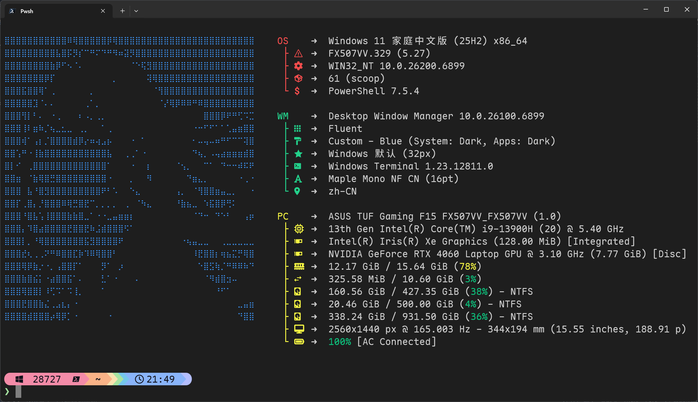

# Fastfetch

## 简介

Fastfetch 是一个能够高度定制的系统信息获取工具。不过在开发者圈子里，这种工具通常被用来展示 ~~炫耀~~ 自己的开发环境和审美

## 对比

事实上类似的工具有很多，比如 `neofetch`，但我喜欢 Fastfetch，主要是这几个优点

- 很快，因为是用 C 实现的
- 功能丰富，可以运行 `fastfetch -c all` 来查看所有功能
- 方便配置，使用 `jsonc` 文件

## 安装

```sh
# Windows
scoop install fastfetch
```

## 使用

### Shell 集成

想要在 Shell 启动时自动调用 `fastfetch` 很简单，只需往配置文件中写入命令就行。

对于 Pwsh，添加如下命令到 `$PROFILE` 的最后一行

```pwsh
fastfetch
```

### 配置文件

Fastfetch 没有一个官方的预设集，也没有一个用图片来展示不同配置文件效果的网站，因此配置起来略微有点麻烦。

我首先通过 `fastfetch --gen-config` 生成了一个基础配置文件，然后参考了 [LierB 的配置文件](https://github.com/LierB/fastfetch/blob/master/presets/groups.jsonc)，再对照[官方文档](https://github.com/fastfetch-cli/fastfetch/wiki/Configuration)和 `fastfetch -c all` 的输出进行修改

最终效果是这样的



该配置以及相关的所有文件都已公开在 [Github](https://github.com/Juemuren/.dotfiles)

*sakiko.txt* 这个文件是通过 `chafa` 转换图片得到的，完整命令为

```sh
chafa -f symbols --symbols braille -c none sakiko.jpg > sakiko.txt
```

fastfetch 支持显示高清的图片，但我个人更喜欢这种风格。如果你想更换 logo 的话，请修改配置文件中的 `logo` 字段
