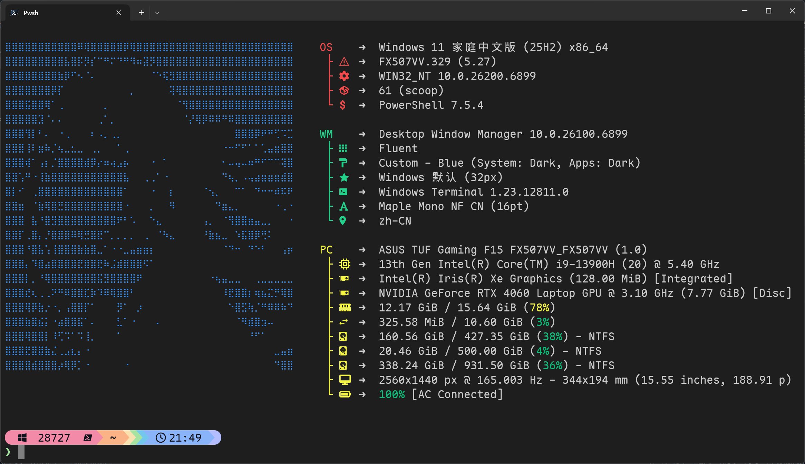

# Fastfetch

## 简介

Fastfetch 是一个能够高度定制的系统信息获取工具。不过在开发者圈子里，这种工具通常被用来展示 ~~炫耀~~ 自己的开发环境和审美

## 对比

事实上类似的工具有很多，比如 `neofetch`，但我喜欢 Fastfetch，主要是这几个优点

- 很快，因为是用 C 实现的
- 功能丰富，可以运行 `fastfetch -c all` 来查看所有功能
- 方便配置，使用 `jsonc` 文件

## 安装

Windows 可通过 Scoop 安装

```sh
scoop install fastfetch
```

## 使用

### Shell 集成

想要在 Shell 启动时自动调用 `fastfetch` 很简单，只需往配置文件中写入命令就行。

对于 Pwsh，添加如下命令到 `$profile` 的最后一行

```pwsh
fastfetch
```

### 配置文件

Fastfetch 没有一个官方的预设集，也没有一个用图片来展示不同配置文件效果的网站，感觉还是蛮遗憾的

我首先通过 `fastfetch --gen-config` 生成了一个基础配置文件，然后参考了 [LierB 的配置文件](https://github.com/LierB/fastfetch/blob/master/presets/groups.jsonc)，再对照[官方文档](https://github.com/fastfetch-cli/fastfetch/wiki/Configuration)和 `fastfetch -c all` 的输出进行修改

最终效果是这样的



配置文件里的 *sakiko.txt* 是通过 `chafa` 转换图片得到的，完整命令为

```sh
chafa -f symbols --symbols braille -c none sakiko.jpg > sakiko.txt
```

fastfetch 支持显示高清的图片，但我个人更喜欢这种风格。如果你想更换 logo 的话，请修改配置文件中的 `logo` 字段

<!-- TODO dotfiles github 仓库 -->
> 由于没给网站配置 `Nerd-Fonts` 字体，所以部分符号可能不会正确显示 ~~本来想先放到 github 上的，没想到 github 也无法渲染 NF 字符~~ 。你可以复制下来在一个有 NF 字体的编辑器里查看。

```json
{
  "$schema": "https://github.com/fastfetch-cli/fastfetch/raw/master/doc/json_schema.json",
  "logo": {
    "source": "~/.local/share/fastfetch/sakiko.txt",
    "type": "auto",
    "padding": {
      "top": 1
    }
  },
  "display": {
    "separator": " ➜  "
  },
  "modules": [
    "break",
    {
      "type": "os",
      "key": "OS   ",
      "keyColor": "red"
    },
    {
      "type": "bios",
      "key": " ├  ",
      "keyColor": "red"
    },
    {
      "type": "kernel",
      "key": " ├  ",
      "keyColor": "red"
    },
    {
      "type": "packages",
      "key": " ├ 󰏖 ",
      "keyColor": "red"
    },
    {
      "type": "shell",
      "key": " └  ",
      "keyColor": "red"
    },
    "break",
    {
      "type": "wm",
      "key": "WM   ",
      "keyColor": "green"
    },
    {
      "type": "theme",
      "key": " ├ 󰀻 ",
      "keyColor": "green"
    },
    {
      "type": "wmtheme",
      "key": " ├ 󰉼 ",
      "keyColor": "green"
    },
    {
      "type": "cursor",
      "key": " ├  ",
      "keyColor": "green"
    },
    {
      "type": "terminal",
      "key": " ├  ",
      "keyColor": "green"
    },
    {
      "type": "terminalfont",
      "key": " ├  ",
      "keyColor": "green"
    },
    {
      "type": "locale",
      "key": " └ 󰍎 ",
      "keyColor": "green"
    },
    "break",
    {
      "type": "host",
      "key": "PC   ",
      "keyColor": "yellow"
    },
    {
      "type": "cpu",
      "key": " ├  ",
      "keyColor": "yellow"
    },
    {
      "type": "gpu",
      "key": " ├ 󰢮 ",
      "keyColor": "yellow"
    },
    {
      "type": "memory",
      "key": " ├  ",
      "keyColor": "yellow"
    },
    {
      "type": "swap",
      "key": " ├ 󰓡 ",
      "keyColor": "yellow"
    },
    {
      "type": "disk",
      "key": " ├ 󰋊 ",
      "keyColor": "yellow"
    },
    {
      "type": "monitor",
      "key": " ├  ",
      "keyColor": "yellow"
    },
    {
      "type": "battery",
      "key": " └  ",
      "keyColor": "yellow"
    },
    "break"
  ]
}
```
