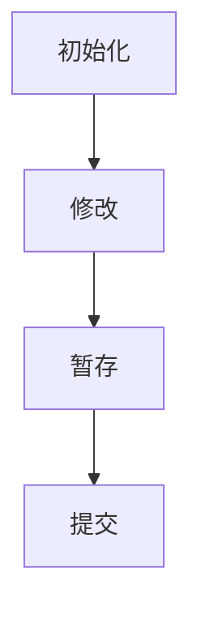
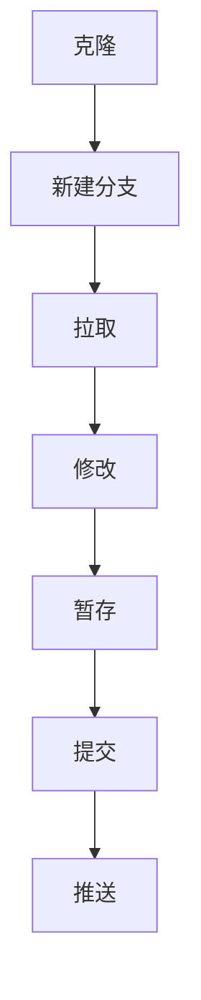

# Git

## 简介

Git 是一个分布式版本控制系统，非常流行，可以称得上是目前的行业标准。

## 主要概念

### 仓库

Git 保存的代码通常被叫做仓库。仓库可以是**本地仓库**，存放在本机上；也可以是**远程仓库**，存放在服务器上。

有很多的服务商可以托管 Git 仓库，比如 GitHub、GitLab 等。这些服务大多都是免费的，让租不起服务器的开发者也能够与别人进行协作，推动了开源社区的发展。

### 提交

代码修改后需要提交，然后变更会被记录到仓库中。

每个提交都会产生一个唯一的哈希值，你可以用这个哈希值来指定具体的单次提交。也可以用 `HEAD` 表示最近的提交，用 `HEAD~n` 来表示最近提交的前 n 个提交

提交时必须有提交信息，这些信息是给人阅读的。提交信息应该遵循一定的规范。[Conventional Commits](https://www.conventionalcommits.org/en/v1.0.0/)是一个社区里常用的提交范式，如果不知道怎么写提交的话可以参考一下。

### 暂存

暂存使得我们可以在未正式提交前就备份代码，并且能够精确控制提交的内容。

暂存区（有时也叫索引）用于存放准备提交的变更。在提交修改后，暂存区会被清空。

### 分支

分支是 Git 中的重要功能，正是分支让 Git 成为了**分布式**的版本控制系统

远程仓库存储公共的分支，而每个协作者只在自己本地私有的分支上修改。这使得协作者只需关注并同步的特定公共分支，而不需要关注其它分支，大大降低了沟通成本

在实现新功能之前最好本地新建一个分支，推送到远程仓库时也应该推送到指定的分支。项目通常会有一个主分支，主分支的代码应保证始终可用。远程仓库中可以启用主分支保护以避免被推送更新，然后由高权限的人员定期将别的分支合并到主分支中

### 钩子

钩子指一段自动触发的脚本。Git 提供了钩子机制，可以在其执行某个操作前/后自动运行一段脚本。

Git 中有很多种钩子，可以修改它们来实现想要的功能。更多介绍请阅读[官方文档](https://git-scm.com/docs/githooks)

- `pre-commit` 提交前钩子，会在 `git commit` 前自动运行
- `post-commit` 提交后钩子，会在 `git commit` 后自动运行
- `commit-msg` 提交消息钩子，由 `git commit`/`git merge` 调用。这个钩子可以直接编辑消息文件来规范提交消息，还可以在检查消息文件后拒绝提交
- `post-checkout` 检出后钩子，会在 `git checkout`/`git switch` 后自动运行
- `pre-rebase` 变基前钩子，会在 `git rebase` 前自动运行
- `post-merge` 合并后钩子，会在 `git merge`/`git pull` 后自动运行
- `pre-push` 推送前钩子，会在 `git push` 前自动运行

对于常用的提交前钩子，社区维护了一个框架，可以在 [prek](Prek.md) 章节中了解更多。

## 安装

```sh
# Windows
scoop install git
# Ubuntu
apt install git
# Arch
pacman -S git
```

## 使用

> [!Tip]- 用户界面
> 大多数 *编辑器*/*集成开发环境* 都能够使用 GUI 进行 Git 操作，你可以阅读相关文档
>
> lazygit 这个命令行工具提供了操作 Git 的 TUI，同样可以降低 Git 的使用门槛

Git 有非常多的子命令，详细的使用说明可以参考[官方文档](https://git-scm.com/docs)

### 基本工作流

对于本地使用，基本的工作流是这样的



```sh
# 初始化本地仓库
git init
# 暂存所有修改
git add --all
# 提交修改
git commit -m "Message"
```

若要远程协作，则工作流会更复杂一点



```sh
# 将远程仓库克隆到本地
git clone <url>
# 创建并切换到新分支
git branch <name>
git switch <name>
# 从远程仓库的指定分支中拉取
git pull <repository-name> <branch-name>
# 推送到远程仓库的指定分支中
git push <repository-name> <branch-name>
```

### 基本设置

Git 使用配置文件，默认位置为 `~/.gitconfig`。可以直接修改文件，也可以使用 CLI 进行配置

一些常用的配置如下

```sh
# 邮箱和姓名
git config --global user.name xxx
git config --global user.email xxx@example.com
# 关闭非 ASCII 字符转义
git config --global core.quotepath false
# 修改默认编辑器
git config --global core.editor 'code --wait'
```

### 分支与合并

分支可以创建、切换、删除

```sh
# 创建分支
git branch <name>
# 切换分支
git switch <name>
# 删除分支
git branch --delete <name>
# 列出所有分支
git branch --all
```

分支合并时如果发生冲突通常需要手动解决

```sh
# 将指定分支合并到当前分支
git merge <name>
```

### 暂存区和工作目录

工作目录中的修改可以保存到暂存区里，也可以移除出暂存区

```sh
# 查看工作目录和暂存区的状态
git status
# 将修改保存到暂存区
git add <file>  # 单个文件
git add .       # 整个目录
# 将修改移除出暂存区
git restore --staged <file>
git restore --staged :/
```

暂存区可作为一个临时的备份，可以查看未暂存或已暂存的更改。也可以随时撤销未暂存的更改，恢复成已暂存的状态

```sh
# 显示未暂存的更改
git diff <file> # 单个文件
git diff        # 整个暂存区
# 显示已暂存的更改
git diff --staged <file>    # 单个文件
git diff --staged           # 整个暂存区 
# 撤销对单个文件的未暂存更改
git restore path/to/file
# 撤销所有的未暂存更改
git restore :/
```

### 提交历史

Git 的提交历史记录了所有的变更。可以查看、比较这些变更

```sh
# 查看完整的提交记录
git log
# 查看提交的详细信息
git show        # 最新提交
git show HEAD~3 # 前三个提交
# 比较两次提交之间的差异
git diff <commit-hash> <commit-hash>
```

Git 的提交历史可以回溯和修改

> [!Warning]+ 修改历史
> 不管是在科幻故事里还是在现实中，修改历史都是个危险的行为。
>
> 在决定修改公共分支的提交之前，最好先新建分支以备份，并和协作者做好沟通。

```sh
# 回溯到之前的某个提交
git reset HEAD~1        # 前一个提交
git reset <commit-hash> # 指定的提交
# 修改、合并、删除某个提交之后的提交
git rebase -i HEAD~5        # 前五个提交
git rebase -i <commit-hash> # 指定的提交
git rebase -i --root        # 初始提交
```
