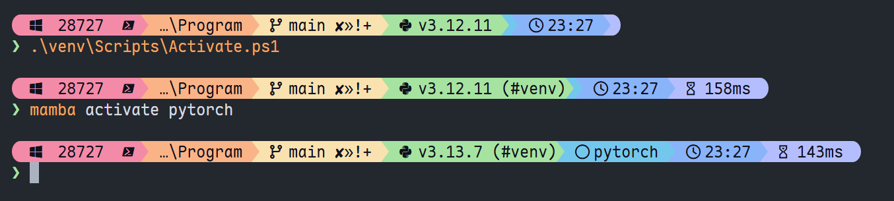

# Starship

## 简介

Starship 是跨平台、跨 Shell 的 prompt 自定义工具。

## 对比

Prompt 美化工具有很多，但我最喜欢 Starship，主要有以下优点

- 由于使用 Rust 实现，所以速度很快
- 由于使用 Rust 实现，所以可以跨平台
- 可以跨 Shell 使用，只需要一份配置文件

## 安装

非常适合使用 Scoop 安装

```sh
scoop install starship
```

## 使用

### Shell 集成

Starship 支持非常多的 Shell，你可以在[官方指南](https://starship.rs/zh-CN/guide)中找到集成方法。

对于 Pwsh，添加如下命令到 `$profile` 里

```pwsh
Invoke-Expression (&starship init powershell)
```

### 配置文件

使用 `starship config` 可以打开配置文件。

官网上有很多的[预设](https://starship.rs/zh-cn/presets/)，还有详细的[配置说明](https://starship.rs/zh-CN/config/)。建议先去看看有没有喜欢的预设，复制过来后再对着配置说明自行修改。

下面分享下我用的配置文件，是在 [Catppuccin Powerline Preset](https://starship.rs/zh-cn/presets/catppuccin-powerline) 这个预设的基础上修改的，效果如下



这个预设非常的花哨和臃肿，建议按需开启功能。由于没给网站配置 Nerd-Fonts 字体，所以部分符号可能不会正确显示。你可以复制下来在一个有 NF 字体的编辑器里查看。

```toml
"$schema" = 'https://starship.rs/config-schema.json'

format = """
[](red)\
$os\
$username\
$shell\
[](fg:red bg:orange)\
$directory\
[](fg:orange bg:yellow)\
$git_branch\
$git_status\
[](fg:yellow bg:green)\
$c\
$cpp\
$dotnet\
$rust\
$golang\
$java\
$lua\
$julia\
$nodejs\
$python\
[](fg:green bg:cyan)\
$docker_context\
$conda\
$mise\
${env_var.MSYSTEM}\
[](fg:cyan bg:blue)\
$time\
[](fg:blue bg:purple)\
$cmd_duration\
$status\
[](purple)\
$line_break\
$shlvl\
$character\
"""

palette = 'rainbow_light'

[os]
disabled = false
style = "bg:red fg:crust"
format = "[ $symbol ]($style)"

[os.symbols]
Windows = ""
Ubuntu = "󰕈"
Arch = "󰣇"
Macos = ""
Android = ""

[username]
disabled = false
show_always = true
style_user = "bg:red fg:crust"
style_root = "bg:red fg:crust"
format = '[ $user ]($style)'

[shell]
disabled = false
bash_indicator = ""
powershell_indicator = ""
zsh_indicator = "󰬇"
style = "bg:red fg:crust"
format = '[ $indicator ]($style)'

[directory]
truncation_length = 3
truncation_symbol = "…/"
style = "bg:orange fg:crust"
format = "[ $path ]($style)"

[git_branch]
symbol = ""
style = "bg:yellow fg:crust"
format = '[ $symbol $branch ]($style)'

[git_status]
style = "bg:yellow fg:crust"
format = '[($all_status$ahead_behind )]($style)'

[c]
symbol = ""
style = "bg:green fg:crust"
format = '[ $symbol ($version-$name )]($style)'

[cpp]
disabled = false
symbol = ""
style = "bg:green fg:crust"
format = '[ $symbol ($version-$name )]($style)'

[dotnet]
symbol = ""
style = "bg:green fg:crust"
format = '[ $symbol ($version )]($style)'

[rust]
symbol = ""
style = "bg:green fg:crust"
format = '[ $symbol ($version )]($style)'

[golang]
symbol = ""
style = "bg:green fg:crust"
format = '[ $symbol ($version )]($style)'

[java]
symbol = ""
style = "bg:green fg:crust"
format = '[ $symbol ($version )]($style)'

[lua]
symbol = ""
style = "bg:green fg:crust"
format = '[ $symbol ($version )]($style)'

[julia]
symbol = ""
style = "bg:green fg:crust"
format = '[ $symbol ($version )]($style)'

[nodejs]
symbol = ""
style = "bg:green fg:crust"
format = '[ $symbol ($version )]($style)'

[python]
symbol = ""
style = "bg:green fg:crust"
format = '[ $symbol ($version )(\(#$virtualenv\))]($style)'

[docker_context]
symbol = ""
style = "bg:cyan fg:crust"
format = '[ $symbol ($context )]($style)'

[conda]
ignore_base = false
symbol = ""
style = "bg:cyan fg:crust"
format = '[ $symbol ($environment )]($style)'

[mise]
disabled = true
symbol = ""
style = "bg:cyan fg:crust"
format = "[ $symbol $health ]($style)"

[env_var.MSYSTEM]
disabled = false
description = "The current msys environment"
symbol = "󰫺"
style = "bg:cyan fg:crust"
format = '[ $symbol ($env_value )]($style)'

[time]
disabled = false
time_format = "%R"
style = "bg:blue fg:crust"
format = '[  $time ]($style)'

[cmd_duration]
disabled = false
show_milliseconds = true
min_time = 100
style = "bg:purple fg:crust"
format = '[ 󰔟 $duration ]($style)'

[status]
disabled = true
symbol = ""
success_symbol = ""
not_executable_symbol = ""
not_found_symbol = ""
sigint_symbol = ""
signal_symbol = "󰉁"
map_symbol = true
style = "bg:purple fg:crust"
format = '[ $symbol $status ]($style)'

[line_break]
disabled = false

[shlvl]
disabled = true
threshold = 0
symbol = "❯"
style = "bold fg:yellow"
format = "[$symbol]($style)"
repeat = true
repeat_offset = 1

[character]
disabled = false
success_symbol = '[❯](bold fg:green)'
error_symbol = '[❯](bold fg:red)'

[palettes.rainbow_light]
red = "#f38ba8"
orange = "#fab387"
yellow = "#f9e2af"
green = "#a6e3a1"
cyan = "#74c7ec"
blue = "#89b4fa"
purple = "#b4befe"
crust = "#11111b"

[palettes.rainbow_dark]
red = '#cc241d'
orange = '#d65d0e'
yellow = '#d79921'
green = '#98971a'
cyan = '#689d6a'
blue = '#458588'
purple = '#6286b1'
crust = '#fbf1c7'
```
