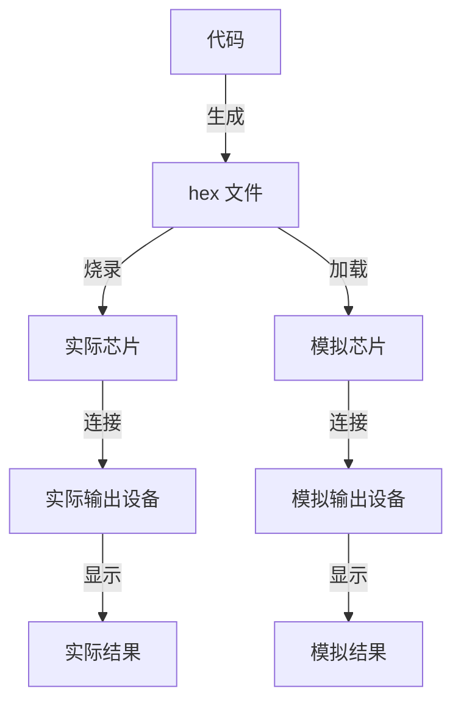

# 嵌入式

## MCU 开发

开发流程（有实际硬件 vs 无实际硬件）

VSCode + PlatformIO IDE + SimulIDE

  - VSCode 写代码
  - PlatformIO IDE 生成 hex 文件
  - SimulIDE 绘制电路图，将模拟芯片和模拟输出设备连接，加载 hex 文件并运行，可视化地查看结果

全流程开源且无需实际硬件

## FPGA 开发

前端，描述数字电路设计，最基本的单元是逻辑门，输出门级网表；后端，布局布线，将门级网表变成比特流烧录进芯片中

iverilog + gtkwave 该软件有 dll 依赖，可能污染系统环境，建议在 MSYS 里用 pacman 装（不过说实话，随着安装的工具变多，MSYS 环境早晚会和系统环境冲突，要编译程序最好还是先进入 MSYS 环境，而不是在系统环境中直接编译）