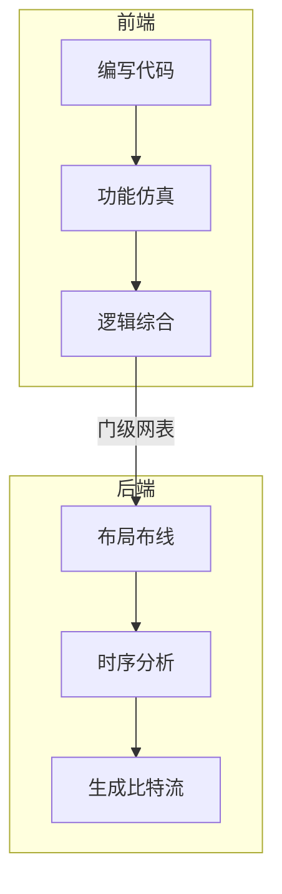

# FPGA

## 基本概念

FPGA 全称为**现场可编程门阵列**。FPGA 开发指使用硬件描述语言在**现场可编程门阵列**内部构建出专用的数字电路。

FPGA 开发可分为前端和后端。前端编写代码，输出由基本逻辑单元组成的门级网表；后端布局布线，将门级网表变成比特流烧录进芯片中

## 环境搭建

我只研究过 FPGA 前端的环境搭建。

我目前使用的开源方案是 VSCode + Icarus Verilog + GTKWave + Yosys

- VSCode 写代码
- Icarus Verilog 编译代码，生成波形文件
- GTKWave 查看波形文件
- Yosys 编译代码，生成门级网表
