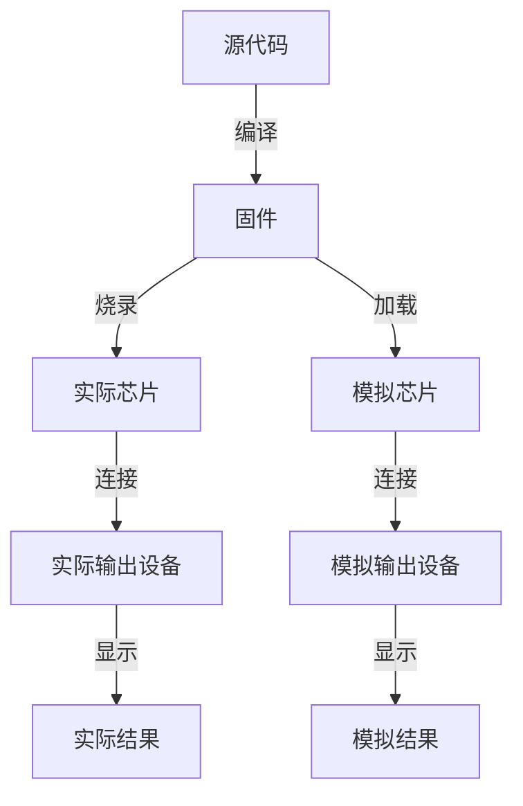

# MCU

## 基本概念

MCU 全称为**微控制器**。MCU 开发指编写能够在微控制器上运行的程序。

由于 MCU 指令集通常比较特殊，主流的编程语言中只有 C 对这些小众指令集支持最好，因此，MCU 开发通常使用 C 编写源代码。代码编译后生成 MCU 能够执行的指令序列，即固件。对固件的处理方式会根据有无实际硬件而发生变化



## 环境搭建

由于我没有实际硬件，且不喜欢非开源的东西，所以稍微研究了一下环境搭建的方式。

我目前使用的方案是 VSCode + PlatformIO IDE + SimulIDE

- VSCode 写代码
- PlatformIO IDE 编译代码，生成固件。由于不同架构的处理器通常需要使用不同的编译器，因此这里只写了 PlatformIO IDE，它会帮你处理这些事情。如果你很清楚自己使用的是哪种芯片，那么可以考虑自己处理编译过程，比如 STM32 可以使用 ARM GCC + CMake 编译出固件。另外，如果不想过度依赖图形化界面，可以[安装 PlatformIO Core](https://docs.platformio.org/en/latest/core/installation/index.html)，这是一个 CLI 工具。
- SimulIDE 绘制电路图，将模拟芯片和模拟输出设备连接，加载固件并运行，从而可视化地查看结果

### SDCC

SDCC 通常用于 8051 MCU 的开发。由于 [vscode-cpptools issues#2499](https://github.com/Microsoft/vscode-cpptools/issues/2499)，目前 VSCode 官方的 C/C++ 插件并不支持 SDCC 拓展的一些类型。

可以手动修改 `.vscode\c_cpp_properties.json` 让编辑器识别这种拓展类型。

```json
{
  "configurations": [
    {
      "defines": [
        // 原有定义
        "__sfr=unsigned char",
        "__sbit=int",
        "__at(a)= ",
        // 更多类型
        ""
      ],
    }
  ]
}
```

不过这只是权宜之计，PlatformIO IDE 会自动更新配置文件，更新后又需要重新修改。并且有的时候 C/C++ 插件甚至无法解析 `compilerPath` 字段，直接连头文件都找不到。我遇到过这个 BUG，至今依然没有找到优雅的解决方法。

这些问题的真正解决也许只有等待 C/C++ 插件正式支持 SDCC 了。
