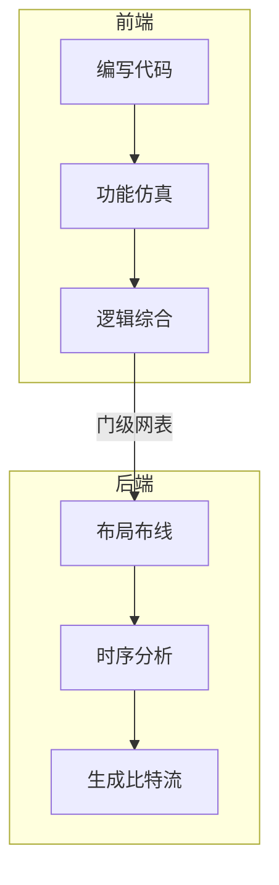

# 嵌入式开发

我对嵌入式开发的了解不多，只简单接触过，并且更侧重软件而非硬件

## MCU

MCU 开发通常是用 C 写源代码，然后编译成 MCU 能够执行的指令并烧录进硬件中

有实际硬件和无实际硬件时开发流程会略有不同


由于我没有实际硬件，且不喜欢非开源的东西，所以稍微研究了一下环境搭建的方式。

我目前使用的方案是 VSCode + PlatformIO IDE + SimulIDE

- VSCode 写代码
- PlatformIO IDE 编译代码，生成固件映像。由于不同架构的处理器通常需要使用不同的编译器，因此这里只写了 PlatformIO IDE，它会帮你处理这些事情。如果你很清楚自己使用的是哪种芯片，那么可以考虑自己处理编译过程，比如 STM32 可以使用 ARM GCC + CMake 编译出固件映像。另外，如果不想过度依赖图形化界面，可以[安装 PlatformIO Core](https://docs.platformio.org/en/latest/core/installation/index.html)，这是一个 CLI 工具。
- SimulIDE 绘制电路图，将模拟芯片和模拟输出设备连接，加载固件映像并运行，从而可视化地查看结果

### SDCC

SDCC 通常用于 8051 MCU 的开发。由于 [vscode-cpptools issues#2499](https://github.com/Microsoft/vscode-cpptools/issues/2499)，目前 VSCode 官方的 C/C++ 插件并不支持 SDCC 拓展的一些类型。

可以手动修改 `.vscode\c_cpp_properties.json` 让编辑器识别这种拓展类型。

```json
{
  "configurations": [
    {
      "defines": [
        // others
        "__sfr=unsigned char",
        "__sbit=int",
        "__at(a)= ",
        ""
      ],
    }
  ]
}
```

还有的时候 C/C++ 插件甚至无法解析 `compilerPath` 字段，直接连编译器的头文件都找不到。我遇到过这个 BUG，并且至今没找到优雅的解决方法。

这些问题的真正解决也许只有等待 C/C++ 插件正式支持 SDCC 了。

## FPGA

FPGA 开发分为前端和后端。前端编写代码，输出由基本逻辑单元组成的门级网表；后端布局布线，将门级网表变成比特流烧录进芯片中



我只研究过 FPGA 前端的环境搭建。

我目前使用的开源方案是 VSCode + Icarus Verilog + GTKWave + Yosys

- VSCode 写代码
- Icarus Verilog 编译代码，生成波形文件
- GTKWave 查看波形文件
- Yosys 编译代码，生成门级网表
