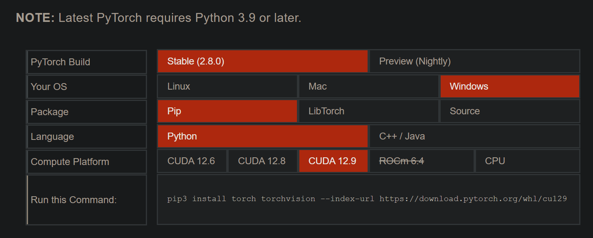

# PyTorch

## 简介

PyTorch 是一个经过优化的深度学习张量库，不过我认为称其为 *机器学习框架* 也没什么问题

## 安装

首先进入[官网的本地安装指导页面](https://pytorch.org/get-started/locally/)，它会检测操作系统和显卡，并推荐下载的版本。



然后你可以自行检测版本是否正确

> [!Tip]+ 检查 CUDA 版本
> 如果使用的是 N 卡，可以运行命令如下查看 CUDA 版本。
>
> ```sh
> nvidia-smi
> ```
>
> CUDA 版本显示在输出结果的右上角。确保你的 CUDA 版本不低于你选的那个。如果版本过低，你可能要升级显卡驱动。

确认无误后，复制表格最下方显示的命令并在激活的环境中运行

```sh
# 这是我的安装命令，你应该去复制网站上的那个而不是下面这个
pip3 install torch torchvision --index-url https://download.pytorch.org/whl/cu129
```

需下载的总文件大约 4G 左右（因版本而异），时间可能有点长，请确保网络通畅

下载完成后，可通过如下方式测试是否可用

```sh
# 运行下行命令以 REPL 模式启动解释器
python
```

```python
# 解释器启动后，输入下行代码
import torch
# 如果没有报错，那就是正确安装了。
# 如果下载的是 CUDA 的版本，可以输入下行代码检查 CUDA 是否可用
torch.cuda.is_available() # 应该返回 True
torch.cuda.get_device_name(0) # 应该返回显卡名称
# 最后可输入下行代码关闭解释器
exit()
```
