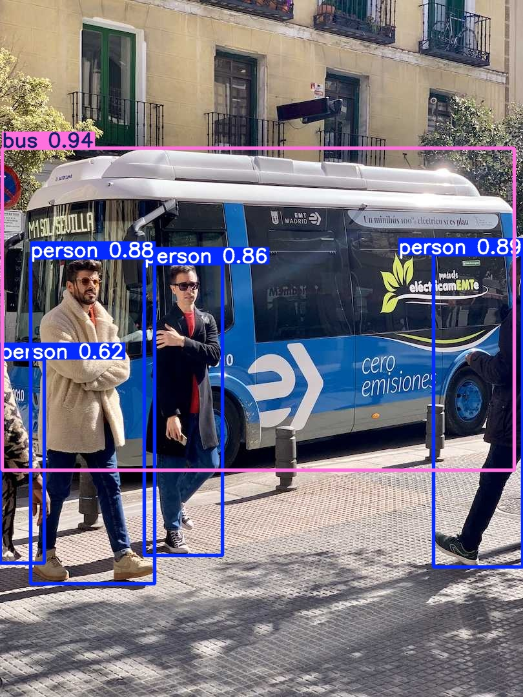
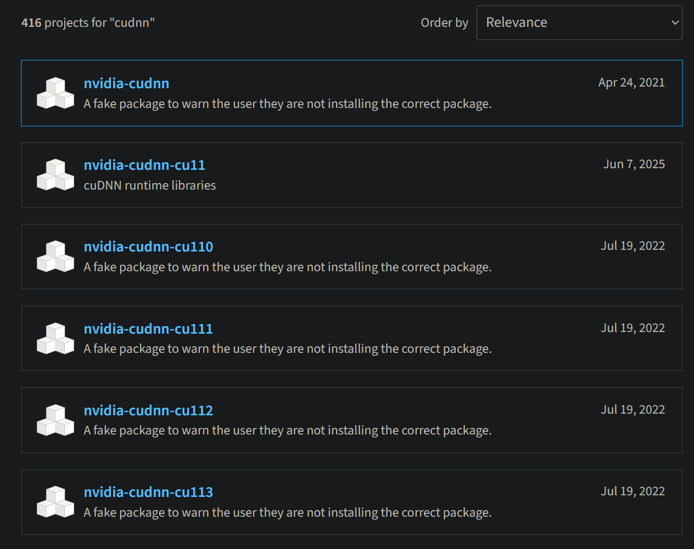
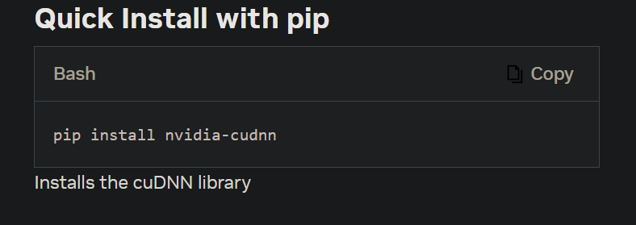

# YOLO

## 简介

YOLO 全称为 *You Only Look Once*，是一类流行的物体检测和图像分割模型

YOLO 本身是指一类模型，但有时也会把官方推出的 Python 库 Ultralytics 称为 YOLO。在这种语境下，YOLO 完全可以算是一个深度学习框架。它本身是基于 PyTorch 实现的，提供了很多模型和功能，接口非常简单

## 环境配置

### 先决条件

#### Miniforge

请先完成 [Miniforge 的安装](../环境管理器/Conda.md#安装)

然后创建一个 `python 3.12` 的环境（*3.12* 是目前 [ultralytics](https://pypi.org/project/ultralytics/) 已验证兼容性的最高版本，不过我用 *3.13* 还没遇到过问题）并激活

```sh
# pytorch 可以换成别的名字
mamba create -n pytorch python=3.12
mamba activate pytorch
```

后续所有命令都在该环境中运行，请确保你激活了正确的环境。

> [!Tip]- 忘了环境名字
> 如果忘记了刚创建的环境的名字，可以使用 `mamba env list` 列出所有环境。

#### PyTorch

在刚激活的环境里完成 [PyTorch 的安装](PyTorch.md)

### 安装

[官方快速入门手册](https://docs.ultralytics.com/zh/quickstart/)推荐使用 pip 安装，因此使用如下命令安装

```sh
pip install ultralytics
```

下载完成后，可通过如下方式测试是否可用

```sh
# 运行下行命令以 REPL 模式启动解释器
python
```

```python
# 解释器启动后，输入下行代码
import ultralytics
# 如果没有报错，那就是正确安装了。输入下行代码关闭解释器
exit()
```

还可以通过如下方式测试是否可用

```sh
yolo checks
```

该命令会打印出非常详细的安装信息。可以简单检查下有没有问题（其中 `CUDA:0` 意思是第 *0* 号显卡有可用的 CUDA，并不意味着有问题）。

最后你还可以实际运行个示例来测试功能是否正常

```sh
yolo predict model=yolo11n.pt source='https://ultralytics.com/images/bus.jpg'
```

该命令会使用官方预训练的模型 `yolo11n.pt` 对 <https://ultralytics.com/images/bus.jpg> 这张图片进行预测。模型和图片会下载到当前工作目录，而运行的结果默认保存在当前工作目录的 `runs` 里。你可以检查下图片是否被正确预测。



> [!Tip]- 网络问题
> 如果因网络问题无法下载图片的话，你可以用自己的图片，只需修改 source 参数即可。如果无法下载模型，你可能不得不先解决网络问题。
>
> ```sh
> # 使用模型 yolo11n.pt 预测当前工作目录下的 example.jpg 图片。
> yolo predict model=yolo11n.pt source='example.jpg'
> ```
>

### 可选项

#### cuDNN

目前我没用到这个库，因此暂时作为可选项。事实上这并不是加速必需的，因为 PyTorch 已经自带了 CUDA 运行时。这个库的作用是让你自己写深度学习框架的时候可以加速。

进入[官网](https://developer.nvidia.com/cudnn)后会看到 NVIDIA 提供了多种安装方式。鉴于前面的库都使用 pip 安装，此处也使用 pip。

不过英伟达非常逆天地在 [PyPI](https://pypi.org/search/?q=cudnn) 上注册了多个假包来告诉你没有安装正确的版本



而更逆天的是官网的安装命令下载的就是假包。



目前 [PyPI](https://pypi.org/search/?q=cudnn) 上这么多的版本中只有 `nvidia-cudnn-cu11`、`nvidia-cudnn-cu12`、`nvidia-cudnn-cu13` 这几个不是假包。请根据显卡的 CUDA 版本下载正确的包。查看 CUDA 版本的方式可参考 [PyTorch 的安装](PyTorch.md#安装) 这部分。

```sh
# 将 nvidia-cudnn-cu1x 替换为与 CUDA 对应的版本
pip install nvidia-cudnn-cu1x
```

同样地，下载完成后，可通过如下方式测试是否可用

```sh
# 运行下行命令以 REPL 模式启动解释器
python
```

```python
# 解释器启动后，输入下行代码
import cudnn
# 如果没有报错，那就是正确安装了。输入下行代码关闭解释器
exit()
```

#### VSCode

推荐使用 *VSCode* 来编写 Python 代码，因为 ~~我喜欢~~ 官方力荐且制作了[相关拓展](https://docs.ultralytics.com/zh/integrations/vscode/)

可以在 VSCode 中安装 [Ultralytics Snippets](https://marketplace.visualstudio.com/items?itemName=Ultralytics.ultralytics-snippets) 这个拓展。顾名思义，此拓展就是提供了一些代码片段（Snippets），不安装并不影响正常使用。

## 使用方法

YOLO 有两种用法，分别是 `Python` 和 `CLI`

### Python

通过 `from ultralytics import YOLO` 来导入 YOLO 库。

该库的接口很多，建议阅读[官方文档](https://docs.ultralytics.com/zh/usage/python/)。

### CLI

YOLO CLI 的基本语法如下

```sh
yolo TASK MODE ARGS
```

其中

- **TASK** （可选）是以下之一 `detect/segment/classify/pose/obb`。如果未明确传递，YOLO 将尝试推断 TASK 。`detect` 是目标检测，`segment` 是语义分割，其余的我没用过。
- **MODE** （必需）是以下之一 `train/val/predict/export/track/benchmark`。`train` 是训练，`val` 是验证，`predict` 是预测，`export` 是导出，`benchmark` 是基准测试，剩下的那个我没用过。
- **ARGS** （可选）是任意数量的自定义 `arg=value` 键值对，例如 `imgsz=320`，用于覆盖默认值。这部分较为复杂，不同的 TASK 配置差别极大，建议参考[官方配置说明](https://docs.ultralytics.com/zh/usage/cfg/)。

更详细的参考请阅读[官方文档](https://docs.ultralytics.com/zh/usage/cli/)

### 示例

#### 项目结构

建议新建一个文件夹，并以如下方式命名和使用子文件夹

```txt
YOLO
├── bin       # 二进制文件
├── data      # 原始数据
├── datasets  # 标注后的数据集
├── docs      # 文档
├── runs      # 运行结果
├── scripts   # 脚本代码
└── weights   # 权重模型
```

然后在 VSCode 中按 `ctrl + k, ctrl + o`，并选择此文件夹打开。

打开文件夹后在 VSCode 中按 `ctrl + shift + ~` 新建终端，激活正确的环境并运行

```sh
yolo settings datasets_dir="datasets"
```

> [!Tip]- 无法激活环境
> 如果无法在 VSCode 的集成终端中激活环境，可能有如下原因
>
> - 未初始化 Shell。可参考 [Conda Shell 集成](../环境管理器/Conda.md#shell-集成) 来解决
> - VSCode 无法识别 Conda 环境。可参考 [Conda 编辑器集成](../环境管理器/Conda.md#编辑器集成) 来解决

之后 YOLO CLI 就会从 `datasets` 中去寻找数据集，从网上下载的示例数据集也会保存在这个目录里。

#### 具体任务

> [!Note]- 阅读官方文档
> 仅展示使用 CLI 进行训练和预测的示例。使用 Python 方法差不多，可以参考部分内容。
>
> 更详细的示例请阅读官方文档，包括 [CLI 示例](https://docs.ultralytics.com/zh/usage/cli/) 和 [Python 示例](https://docs.ultralytics.com/zh/usage/python/)

##### 训练

YOLO 的训练数据集建议按如下方式组织结构

```txt
example
├── images
│   ├── train
│   └── val
└── labels
    ├── train
    └── val
```

分别把训练集的图片和标签放入 `images/train` 和 `labels/train` 里，验证集则是 `images/val` 和 `labels/val`。注意图片和标签的文件名必须相同。

然后把 `example` 这个文件夹放入 `datasets` 目录下，并在项目根目录新建一个 `example.yaml` 文件，填写上如下内容：

```yaml
path: example

train: images/train
val: images/val

names: 
  0: low
  1: medium
  # 省略剩余的标签
```

接着运行如下命令

```sh
yolo detect train data='example.yaml' model=yolo11n.pt epochs=10 imgsz=640
```

这会运行目标检测的模型训练，其中数据集是 `datasets/example`，在 `yolo11n.pt` 模型的基础上训练，并以 `epochs=10 imgsz=640` 覆盖默认参数值。更详细的说明请参考[官方文档-训练](https://docs.ultralytics.com/zh/modes/train/)。

训练的结果保存在 `runs/detect` 目录下。

##### 预测

将你要预测的图片放入 `data` 文件夹里，并运行如下命令

```sh
yolo segment predict model=yolo11n-seg.pt source='data' imgsz=320
```

这会运行语义分割的图片预测，其中数据来源是 `data`，而模型权重使用 `yolo11n-seg.pt`，并以 `imgsz=320` 覆盖默认参数值。更详细的说明请参考[官方文档-预测](https://docs.ultralytics.com/zh/modes/predict/)。

训练的结果保存在 `runs/segment` 目录下。
