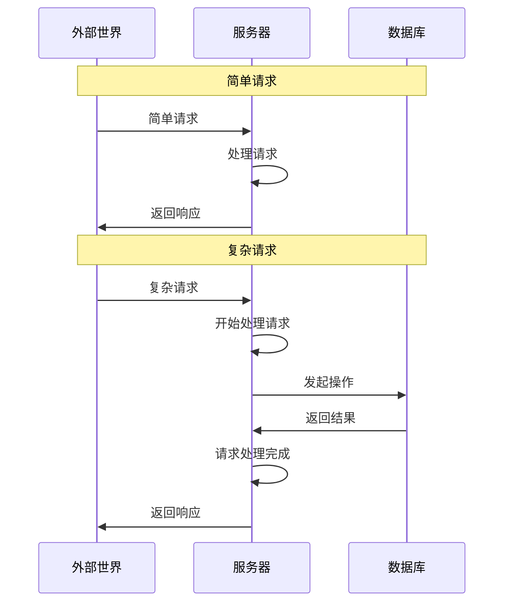
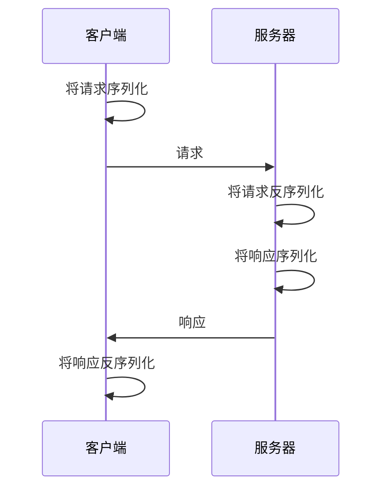
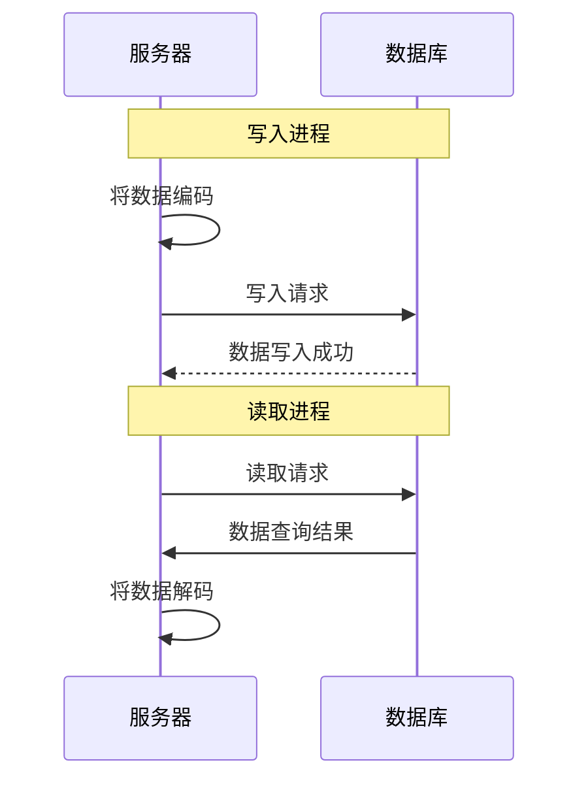
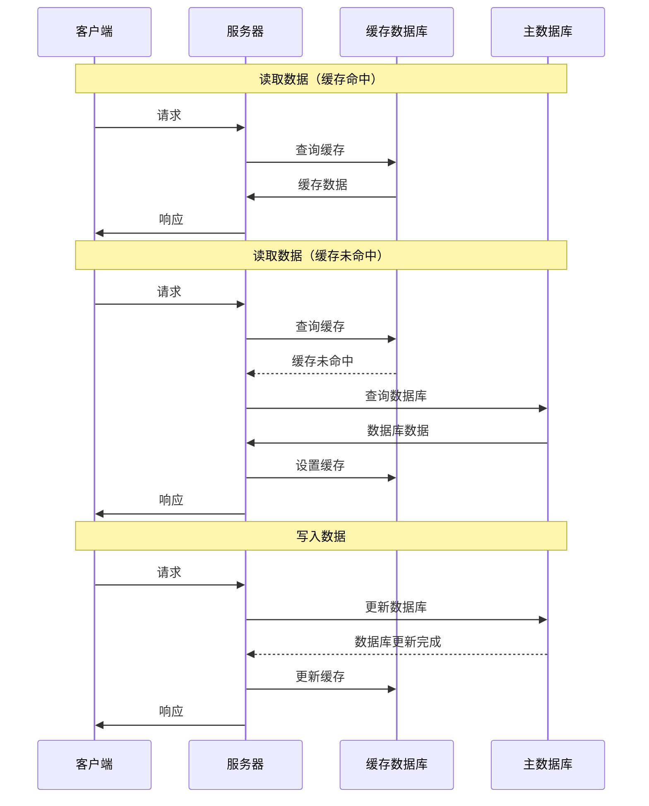
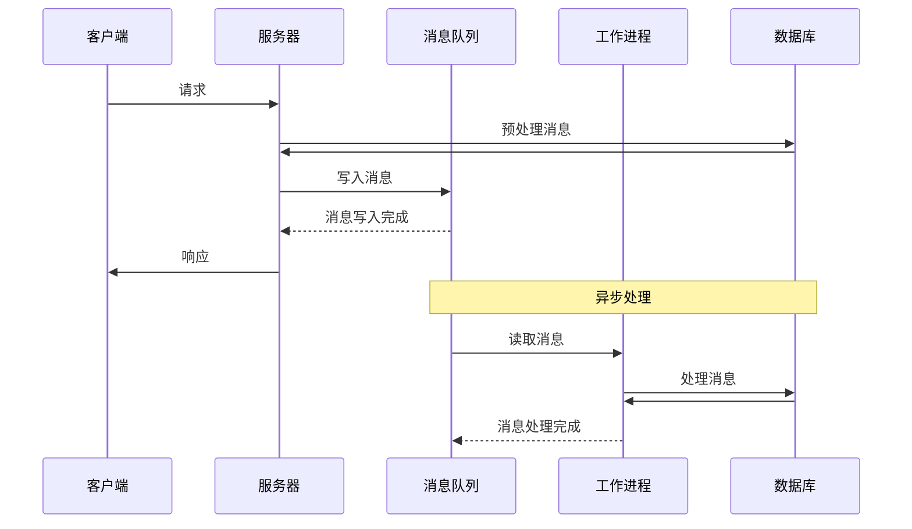

# API

## 基本概念

API 全称为 `应用程序编程接口`。API 一词含义相当丰富，在本文专指远程调用的接口。服务器通过 API 对外提供自己的服务；外部世界可以发起网络请求调用 API 来使用服务。

收到外部世界的请求后，服务器要对请求进行处理。部分请求可能需要用到数据。直接在服务器的文件系统上存储数据是很不靠谱的，因此通常会使用数据库来存储数据。API 开发者的主要工作就是实现需要的接口，并处理和数据库之间的交互。

## 主要技术

### 操作系统

API 开发者编写的应用运行在服务器环境中。由于大多数服务器都使用无桌面系统的 Linux，因此对于 Linux 和命令行应该要有一点了解。根据团队分工的不同，API 开发者需要掌握的技能也不同，但我认为一些基本的使用和调试能力还是要有的

- 可以日常使用。比如通过 SSH 连接到服务器、用无 GUI 的编辑器临时修改文件等
- 能够排查问题。比如分析日志、诊断性能、管理进程等

### 数据库

由于大多数应用都是数据密集型应用，因此处理数据就是 API 开发的核心。而处理数据通常都会使用到数据库。

> [!Note]+ 文件系统和数据库系统的区别
> 文件系统是操作系统中用于管理文件和目录的底层系统。而数据库系统是专门用于管理结构化数据的软件系统。
>
> 数据库通常基于文件系统，但提供了更方便的接口、更丰富的特性，并针对存储、查询等进行了性能上的优化。因此，数据一般不直接存储在服务器的文件系统上，而是存储在数据库中。

#### 数据模型

通常会根据需要处理的数据模型来选择合适的数据库。常见的数据模型有以下几种

- 关系数据模型：基于关系对数据建模，将数据以表的形式存储，适合大多数应用
- 文档数据模型：基于文档对数据建模，适合那种数据主要为自包含文档，且不同文档之间关联很少的应用
- 图数据模型：基于节点和边对数据建模，适合所有数据互相关联的应用

关系数据库不仅可以对关系数据模型建模，也可以对文档数据模型/图数据模型建模，尽管处理这种数据时不如文档数据库/图数据库方便。因此在不确定会使用什么数据模型时，关系数据库通常就是最好的选择。

#### 数据库设计范式

数据库设计范式有很多，规范性通常是逐渐递进的

- 第一范式：确保每列具有原子性
- 第二范式：消除部分依赖
- 第三范式：消除传递依赖

另外还有特殊的反范式设计，即为了性能优化而有意违反范式

#### 数据库语言

Web 开发绕不开 **HTML**/**CSS**/**JavaScript**，而 API 开发在这方面相对自由一点，通用编程语言都可以写那些能够在服务器里运行的程序。不过由于要处理和数据库的交互，因此大多数时候数据库语言也是绕不开的。

**SQL** 作为最常用的数据库——关系数据库的语言，API 开发者很难不接触到它。当然了，正如同 Web 开发者可以通过框架尽量不直接写 **HTML**/**CSS**/**JavaScript**，API 开发者也可以利用 *ORM/ODM* 来尽量少写数据库语言

### 接口

#### 数据编码

对于大多数编程语言，保存在内存中的数据结构会用到指针以方便 CPU 高效地进行访问。然而这些指针在内存外是没有意义的，因此把数据通过网络传输或存储进数据库之前，通常都要对内存中的数据进行 **编码**/**序列化**。与之相反的过程——把收到的请求或从数据库中读取到的数据，变为内存中可高效访问的数据结构——通常叫做 **解码**/**解析**/**反序列化**。

数据编码方式有两种主要的选择

- 文本格式。`JSON` 是最常用的文本编码格式。文本格式的好处是具有人类可读性，缺点是占用体积大，解析也更慢一点。
- 二进制格式。`Protobuf` 是最常用的二进制编码格式。二进制格式的优缺点正好和文本格式相反。

#### 接口设计范式

API 设计方式有很多，在实践中通常会使用 `RESTful` 或 `GraphQL` 的范式。

实现这些范式可以使用框架。基本上主流的编程语言都有实现 `RESTful` 的框架，而 `GraphQL` 比较新，目前好用的框架比较少。

### 数据流

服务器和数据库之间最简单的数据流，就是写入数据库的进程对数据进行编码，而读取数据库的进程对数据进行解码

但实际的数据流通常更为复杂，比如引入 **缓存** 和 **消息队列**

#### 缓存

缓存是一种 **临时存储**。通过把频繁访问的数据存储在能快速访问的介质中，可以减少对慢速数据源的访问次数，从而提高查询速度。

在使用数据库的时候，为了提高查询速度，通常会配备一个缓存数据库。为了区分，原先的数据库有时会被叫做主数据库。

缓存数据库通常有以下特性

- 内存存储。缓存数据库将数据存储在内存中，显然访问内存比访问磁盘更快
- 键值存储。缓存数据库使用键值对，可以根据键快速地索引值
- 数据有效期。缓存数据库可以设置缓存的过期时间，以改善数据的一致性

#### 消息队列

消息队列是一种 **异步通信系统**。生产者将消息放入队列，消费者从队列中取出消息，并进行处理。

在 API 开发的语境中，生产者通常是服务器主进程，而消费者则是各种工作进程。通过把消息统一放入消息队列并进行异步处理，服务的并行程度得到了提高。

消息队列通常有以下功能

- 服务解耦。消息队列要求整个服务拆分成多个模块，可以实现服务间的解耦
- 流量削峰。消息队列可以缓冲部分请求，让生产者和消费者不需要同时空闲
- 提高可靠性。消息队列能够确保消息不丢失，从而提高服务的可靠性

### 运维

运维指运营和维护，在软件工程中运维主要的工作就是保障生产环境的稳定，并及时发现和修复服务存在的问题。

不过时下流行的趋势叫做 **DevOps**，*Dev* 即 *Development*，*Ops* 即 *Operations*，**DevOps** 的目标是打通开发和运维之间的壁垒，实现开发运维一体化。为了实现这一目标，开发者必须了解一些运维的基本知识

#### 部署

API 搭建完成后，为了能够被远程机器调用，需要对其进行部署。API 的部署就是在一台能够通过网络进行访问的机器上运行服务端程序，该服务端程序会监听一个或多个网络端口以获取外部请求。

API 的部署方法有很多，可以简单分为两类

- 自建服务器。控制力最好，但门槛高、成本高、弹性差，需要自己解决计算、存储、网络等基础设施。
- 使用云服务。通常需要向服务商支付租金，长期成本可能高于自建服务器，但弹性好且门槛更低。

云服务又可以根据提供的服务内容分为多种类型

- IaaS，基础设施即服务。向云服务商租服务器，不需要自己捣鼓基础设施，但还需要管理应用及其运行时环境。例如 **AWS EC2**、**阿里云 ECS**
- PaaS，平台即服务。服务商提供应用运行的全套平台，用户只需要关心代码和数据。例如 **Heroku**、**Railway**、**Render**
- FaaS，函数即服务。应用拆分成独立的函数，平台以函数为单位按需运行代码。例如 **AWS Lambda**、**腾讯云 SCF**
- CaaS，容器即服务。应用打包成容器并进行编排，平台负责管理容器。例如 **AWS EKS**、**阿里云 ACK**

#### 持续集成

持续集成（CI）的核心思想是让开发团队频繁地将代码集成到共享的主干分支中，每次集成都通过自动化的构建和测试来验证代码，以便尽早发现并修复错误。

CI 有以下这些好处

- 频繁提交：避免长期在独立分支开发，减少合并时的冲突和风险
- 快速反馈：开发者能立即知道本次提交是否破坏了现有功能，提前暴露错误，降低修复成本
- 自动流程：自动化测试保证了代码质量，且同样的流水线也可以实现持续交付和持续部署

CI 的标准工作流程通常包括这些步骤

  1. 代码提交。开发者将代码推送到版本控制系统的共享分支中
  2. 检测变更。CI 服务器监测到代码变更，开始工作
  3. 运行流水线。CI 服务器运行预先定义好的流水线任务，而这种流水线的一个示例如下
     1. 拉取代码。获取最新的代码
     2. 依赖安装。安装项目的所有依赖
     3. 静态检查。运行代码静态检查工具
     4. 编译构建。将源代码编译成可执行文件或字节码
     5. 运行测试。执行单元测试、集成测试等
     6. 打包发布。打包构建成功的应用并进行部署或交付
  4. 反馈结果。CI 服务器将成功或失败的结果报告给开发者

这些任务当然可以手动处理，但只有自动化的流水线才能够频繁地运行，从而实现持续集成。

#### 日志和监控

日志是系统在运行时产生的结构化或半结构化的文本记录，用于描述发生的 **事件**。日志通常用于排查问题、理解系统行为、进行审计和分析。

从细到粗，日志存在以下常见的各种级别

- DEBUG，调试信息，会包含很多程序的内部细节，通常用于开发阶段
- INFO，常规信息，通常就是如实报告发生的各个事件
- WARN，警告信息，表明某个功能可能存在问题，需要关注
- ERROR，错误信息，表明某个功能已经出现问题，需要修复
- FATAL，严重错误，通常系统此时已经崩溃

监控是对运行的系统进行持续性地测量、收集、分析，以评估其性能和健康状况。监控的对象通常是 **指标**。

对于 API 开发，监控常用的一些指标如下

- 延迟。处理请求所花费的时间
- 流量。系统的负载，如每秒请求数、并发连接数
- 错误。请求失败的比率
- 饱和度。系统资源的使用程度

## 框架/库/工具

由于 API 开发可选的语言很多，所以下面的框架/库并不局限于一种语言。有些框架/库可能提供了多个语言的接口，有些可能只有特定语言才可以使用。对于那些编程语言各自的通用框架/库/工具，由于它们并不专属于 API 开发，因此不会列举在这里，可以在 [编程语言](../编程语言/index.md) 章节中查看对应的语言。

### 后端框架

- Express 用来实现 RESTful API 的 JavaScript 框架
- FastAPI 用来实现 RESTful API 的 Python 框架
- Apollo 用来实现 GraphQL API 的 JavaScript 框架，分为 Server 和 Client，后者用来在前端调用 GraphQL 接口
- Gin 用来实现 RESTful API 的 Go 框架

### 接口生成器

- openapi-generator 代码生成工具，可以根据 API 规范自动生成客户端、服务端和测试的代码

### 数据库映射

- mongoose JavaScript 的 ODM 库，支持 MongoDB 数据库
- sequelize JavaScript 的 ORM 库。支持很多关系数据库，包括 PostgresSQL、SQLite、MySQL 等

### 日志

- morgan JavaScript 的请求日志库，配置起来很简单

### 安全

- bcrypt 加密库，很多语言都有这个库
- jsonwebtoken 处理令牌验证的库，很多语言都有类似的库
- cors 处理 CORS 错误的库，很多语言都有这个库

### 测试接口

一个 API 实现后，并不是只能在 *Web 应用* 中调用。移动应用/桌面应用/命令行应用都可以调用这个 API。爬虫通常就是指那些运行在命令行里的、自动向服务器发送请求并抓取数据的程序。

有些时候后端先实现了 API 但前端尚未搭建好，我们可能希望测试一下接口是否正确，但又不想自己写程序或者使用复杂的 `curl` 命令。这时就可以使用一些工具辅助测试接口。

- Rest Client 一个 VSCode 拓展，通过 *.rest* 和 *.http* 文件测试接口
- httpYac 提供了 CLI 和 VSCode 拓展多种形式，同时兼容并拓展了 Rest Client 使用的语法
- HTTPie 用来发送 HTTP 请求的工具
- xh 类似 `HTTPie`，不过是用 Rust 写的
