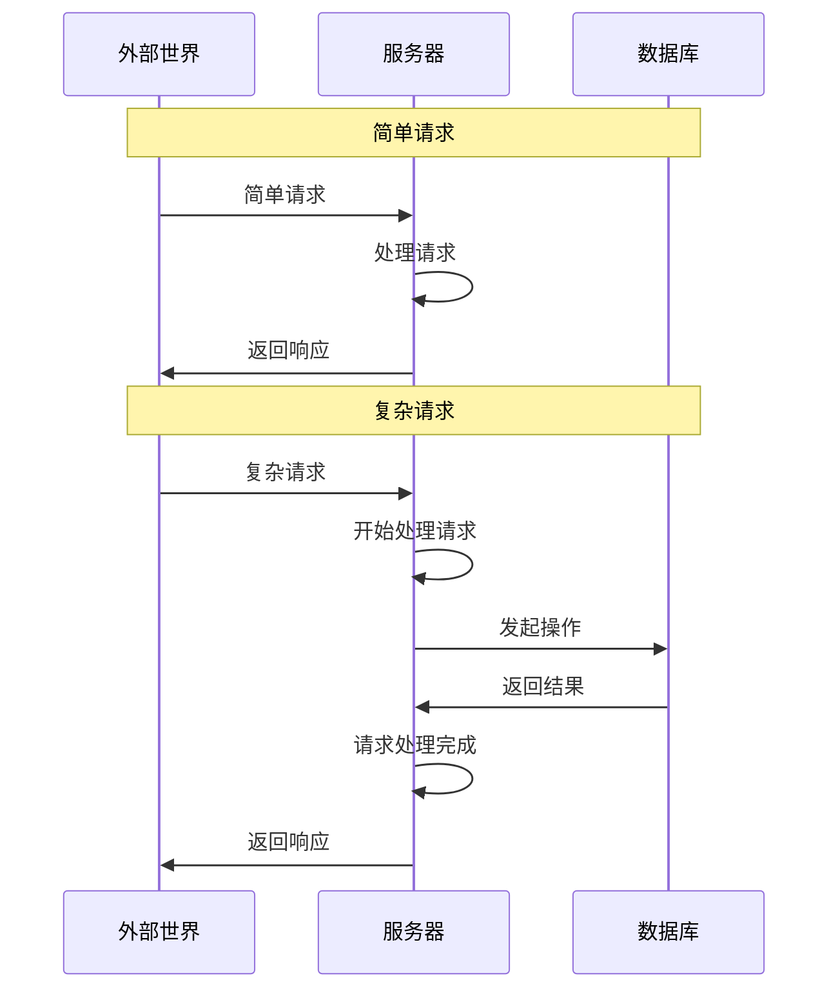

# API

## 基本概念

API 全称为 `应用程序编程接口`。API 一词含义相当丰富，在本文专指远程调用的接口。服务器通过 API 对外提供自己的服务；外部世界可以发起网络请求调用 API 来使用服务。

收到外部世界的请求后，服务器要对请求进行处理。部分请求可能需要用到数据。直接在服务器的文件系统上存储数据是很不靠谱的，因此通常会使用数据库来存储数据。API 开发者的主要工作就是实现需要的接口，并处理和数据库之间的交互。

## 主要技术

### 操作系统

API 开发者编写的应用运行在服务器环境中。由于大多数服务器都使用无桌面系统的 Linux，因此对于 Linux 和命令行应该要有一点了解。根据团队分工的不同，API 开发者需要掌握的技能也不同，但我认为一些基本的使用和调试能力还是要有的

- 可以日常使用。比如通过 SSH 连接到服务器、用无 GUI 的编辑器临时修改文件等
- 能够排查问题。比如分析日志、诊断性能、管理进程等

### 数据库

由于大多数应用都是数据密集型应用，因此处理数据就是 API 开发的核心。而处理数据通常都会使用到数据库。

> [!Note]+ 文件系统和数据库系统的区别
> 文件系统是操作系统中用于管理文件和目录的底层系统。而数据库系统是专门用于管理结构化数据的软件系统。
>
> 数据库通常基于文件系统，但提供了更方便的接口、更丰富的特性，并针对存储、查询等进行了性能上的优化。因此，数据一般不直接存储在服务器的文件系统上，而是存储在数据库中。

#### 数据模型

通常会根据需要处理的数据模型来选择合适的数据库。常见的数据模型有以下几种

- 关系数据模型：基于关系对数据建模，将数据以表的形式存储，适合大多数应用
- 文档数据模型：基于文档对数据建模，适合那种数据主要为自包含文档，且不同文档之间关联很少的应用
- 图数据模型：基于节点和边对数据建模，适合所有数据互相关联的应用

关系数据库不仅可以对关系数据模型建模，也可以对文档数据模型/图数据模型建模，尽管处理这种数据时不如文档数据库/图数据库方便。因此在不确定会使用什么数据模型时，关系数据库通常就是最好的选择。

#### 数据库设计范式

数据库设计范式有很多，规范性通常是逐渐递进的

- 第一范式：确保每列具有原子性
- 第二范式：消除部分依赖
- 第三范式：消除传递依赖

另外还有特殊的反范式设计，即为了性能优化而有意违反范式

#### 数据库语言

Web 开发绕不开 **HTML**/**CSS**/**JavaScript**，而 API 开发在这方面相对自由一点，通用编程语言都可以写那些能够在服务器里运行的程序。不过由于要处理和数据库的交互，因此大多数时候数据库语言也是绕不开的。

**SQL** 作为最常用的数据库——关系数据库的语言，API 开发者很难不接触到它。当然了，正如同 Web 开发者可以通过框架尽量不直接写 **HTML**/**CSS**/**JavaScript**，API 开发者也可以利用 *ORM/ODM* 来尽量少写数据库语言

### 接口

#### 数据编码方式

对于大多数编程语言，保存在内存中的数据结构会用到指针以方便 CPU 高效地进行访问。然而这些指针在内存外是没有意义的，因此把数据通过网络传输或存储进数据库之前，通常都要对内存中的数据进行 **编码**/**序列化**。与之相反的过程——把收到的请求或从数据库中读取到的数据，变为内存中可高效访问的数据结构——通常叫做 **解码**/**解析**/**反序列化**。

数据编码方式有两种主要的选择

- 文本格式。`JSON` 是最常用的文本编码格式。文本格式的好处是具有人类可读性，缺点是占用体积大，解析也更慢一点。
- 二进制格式。`Protobuf` 是最常用的二进制编码格式。二进制格式的优缺点正好和文本格式相反。

#### 接口设计范式

API 设计方式有很多，在实践中通常会使用 `RESTful` 或 `GraphQL` 的范式。

实现这些范式可以使用框架。基本上主流的编程语言都有实现 `RESTful` 的框架，而 `GraphQL` 比较新，目前好用的框架比较少。

### 更多后端技术

我对后端开发了解不多，很多技术可以自行了解

- 缓存
- 消息队列

还有一些技术传统上认为属于后端，但我觉得更接近 *运维/管理* 这方面，但也列举在这里好了

- 服务架构设计
- 容器化
- 持续集成
- 日志
- 监控

## 框架/库/工具

由于 API 开发可选的语言很多，所以下面的框架/库并不局限于一种语言。有些框架/库可能提供了多个语言的接口，有些可能只有特定语言才可以使用。对于那些编程语言各自的通用框架/库/工具，由于它们并不专属于 API 开发，因此不会列举在这里，可以在 [编程语言](../编程语言/index.md) 章节中查看对应的语言。

### 后端框架

- Express 用来实现 RESTful API 的 JavaScript 框架
- FastAPI 用来实现 RESTful API 的 Python 框架
- Apollo 用来实现 GraphQL API 的 JavaScript 框架，分为 Server 和 Client，后者用来在前端调用 GraphQL 接口
- Gin 用来实现 RESTful API 的 Go 框架

### 接口生成器

- openapi-generator 代码生成工具，可以根据 API 规范自动生成客户端、服务端和测试的代码

### 数据库映射

- mongoose JavaScript 的 ODM 库，支持 MongoDB 数据库
- sequelize JavaScript 的 ORM 库。支持很多关系数据库，包括 PostgresSQL、SQLite、MySQL 等

### 日志

- morgan JavaScript 的请求日志库，配置起来很简单

### 安全

- bcrypt 加密库，很多语言都有这个库
- jsonwebtoken 处理令牌验证的库，很多语言都有类似的库
- cors 处理 CORS 错误的库，很多语言都有这个库

### 测试接口

一个 API 实现后，并不是只能在 *Web 应用* 中调用。移动应用/桌面应用/命令行应用都可以调用这个 API。爬虫通常就是指那些运行在命令行里的、自动向服务器发送请求并抓取数据的程序。

有些时候后端先实现了 API 但前端尚未搭建好，我们可能希望测试一下接口是否正确，但又不想自己写程序或者使用复杂的 `curl` 命令。这时就可以使用一些工具辅助测试接口。

- Rest Client VSCode 插件，通过 .rest 和 .http 文件测试接口
- httpYac 提供了 CLI 和 VSCode 插件多种形式，同时兼容并拓展了 Rest Client 使用的语法
- HTTPie 用来发送 HTTP 请求的工具
- xh 类似 `HTTPie`，不过是用 Rust 写的
