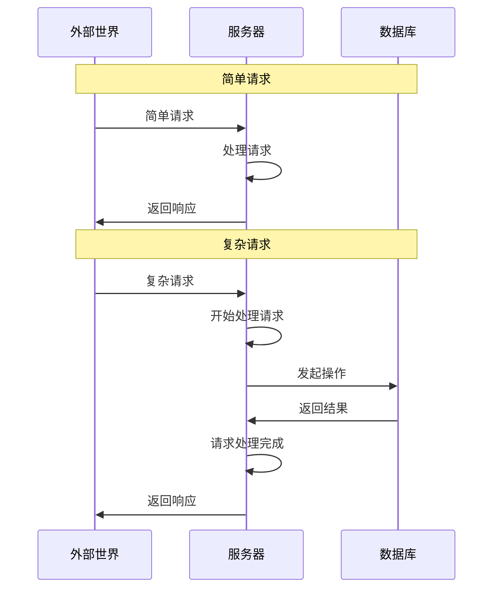

# API

## 基本概念

收到外部世界的请求后，服务器要对请求进行处理。部分请求可能需要用到数据。直接以文件形式在服务器上存储数据是很不靠谱的，因此通常会使用数据库来存储数据。API 开发者的主要工作就是实现需要的接口，并处理和数据库之间的交互。

```mermaid
sequenceDiagram

  participant B as 外部世界
  participant S as 服务器
  participant D as 数据库
  
  Note over B, D: 简单请求
  B ->> S: 简单请求
  S ->> S: 处理请求
  S ->> B: 返回响应

  Note over B, D: 复杂请求
  B ->> S: 复杂请求
  S ->> S: 开始处理请求
  S ->> D: 发起操作
  D ->> S: 返回结果
  S ->> S: 请求处理完成
  S ->> B: 返回响应
```

### 主要技术

#### OS

API 开发者编写的应用运行在服务器环境中。由于大多数服务器都使用 Linux 系统，因此对于 Linux 应该要有一点基本的了解，至少要能够调试自己编写的程序。

#### RESTful/GraphQL

API 设计方式有很多，在实践中通常会使用 `RESTful` 或 `GraphQL` 的范式。实现这些范式可以使用框架。基本上主流的编程语言都有实现 `RESTful` 的框架，而 `GraphQL` 比较新，目前好用的框架比较少。

#### SQL

Web 开发绕不开 **HTML**/**CSS**/**JavaScript**，而 API 开发在这方面相对自由一点，通用编程语言都可以写那些能够在服务器里运行的程序。不过由于要处理和数据库的交互，因此大多数时候数据库语言，即 **SQL** 也是绕不开的。

当然了，正如同 Web 开发者可以通过框架尽量不直接写 **HTML**/**CSS**/**JavaScript**，API 开发者也可以利用 *ORM/ODM* 来尽量少写 **SQL**

### 框架/库/工具

由于 API 开发可选的语言很多，所以下面的框架/库并不局限于一种语言。有些框架/库可能提供了多个语言的接口，有些可能只有特定语言才可以使用。对于那些编程语言各自的通用库/工具，它们并不专属于 Web，因此不会列举在这里，可以在[编程语言](../编程语言/index.md)章节中查看对应的语言。

#### API 框架

- Express 用来实现 RESTful API 的 JavaScript 框架
- FastAPI 用来实现 RESTful API 的 Python 框架
- Apollo 用来实现 GraphQL API 的 JavaScript 框架，分为 Server 和 Client，后者用来在前端调用 GraphQL 接口

#### 数据库映射

- mongoose JavaScript 的 ODM 库，支持 MongoDB 数据库
- sequelize JavaScript 的 ORM 库。支持很多关系数据库，包括 PostgresSQL、SQLite、MySQL 等

#### 日志

- morgan JavaScript 的请求日志库，配置起来很简单

#### 安全

- bcrypt 加密库，很多语言都有这个库
- jsonwebtoken 处理令牌验证的库，有非常多的语言都实现了这个库的功能
- cors 处理 CORS 错误的库，很多语言都有这个库

#### 测试接口

一个 API 实现后，并不是只能在 *Web 应用* 中调用。移动应用/桌面应用/命令行应用都可以调用这个 API。爬虫通常就是指那些运行命令行里的、自动向服务器发送请求并抓取数据的程序。

有些时候后端先实现了 API 但前端尚未搭建好，我们可能希望测试一下接口是否正确，但又不想自己写程序或者使用复杂的 `curl` 命令。这时就可以使用一些工具辅助测试接口。

- Rest Client VSCode 插件，通过 .rest 和 .http 文件测试接口
- httpYac 提供了 CLI 和 VSCode 插件多种形式，同时兼容并拓展了 Rest Client 使用的语法
