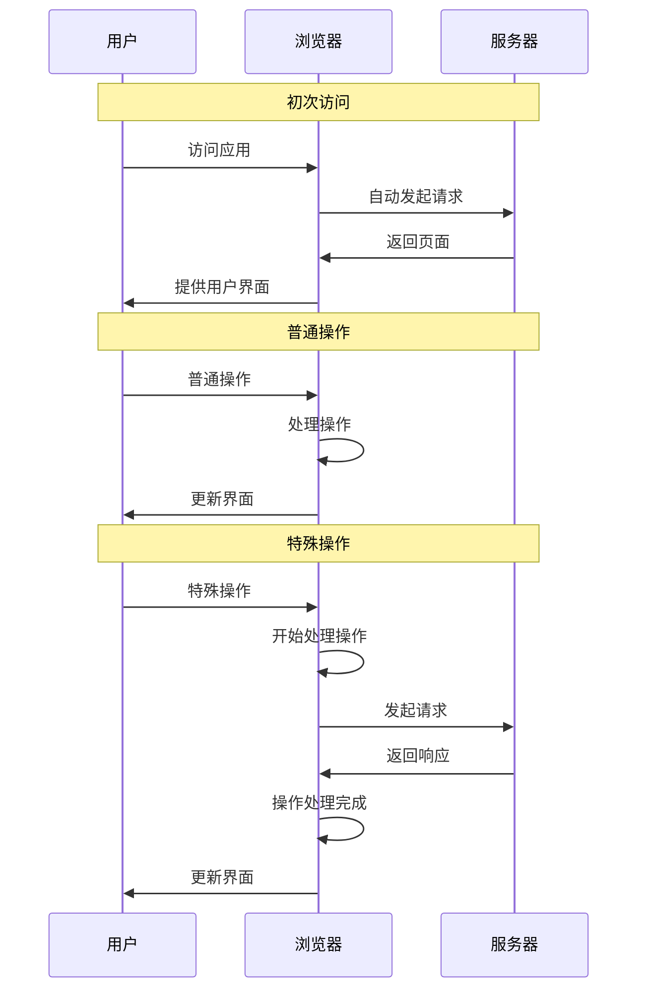

# Web

## 基本概念

Web 应用是指一类能够在浏览器中运行的应用。

> [!Note]- Web 一词的翻译
> Web 一词一直都没有合适的中文翻译。以下翻译虽然有人使用，但其实都不好，因为它们已经有了更准确的英文，会造成混淆
>
> - 网站 Website
> - 网页 Webpage
> - 网络 Network
> - 互联网 Internet
>
> `Web` 在英文里就是个很抽象的词，因此最贴切的中文翻译也一定是抽象的，比如 `网`。但显然这个翻译太怪了，所以之后将不翻译 Web 一词

得益于技术的发展，现代 Web 应用已经不再是那种只提供静态资源的普通网站，而几乎可以做到所有原生应用能做到的事情。

> [!Note]- 前端和后端
> 现代 *Web* 应用通常都会使用 **前后端分离** 的设计：前端开发浏览器里运行的客户端应用，后端开发服务器里运行的服务端应用。但我不会把后端开发归类为 *Web 开发*，也不会把后端实现的 API 视为 *Web 应用* 的一部分。因为后端实现的 API 也可以用于非 Web 应用，尽管其中的大部分技术起源于 Web。
>
> 如果你认同 *前端* 和 *后端* 这种叫法，那么本文只涉及前端，后端部分在 [API 开发](API.md)中。

当用户访问 Web 应用时，浏览器会自动发起一个请求，然后服务器返回一些文件，这些文件构成了用户界面。用户在这个界面中操作，有些操作可以直接在浏览器中完成，有些则需要和服务器通信。Web 开发者的主要工作就是编写用户界面、实现那些能够直接在浏览器中完成的操作，并处理和服务器的交互。

## 主要技术

### 浏览器

Web 开发者编写的应用运行在浏览器环境中，因此应该掌握基本的浏览器调试方法。

大多数浏览器都提供了 `DevTools`，这是一个开发者调试面版，内容非常丰富。我个人常用的几个功能是

- `Elements 元素` 查看并修改当前的 HTML 结构和每个元素的样式
- `Console 控制台` 查看输出以及运行代码
- `Network 网络` 查看网络请求和响应
- `Sources 源代码` 查看源代码以及调试程序
- `Application 应用程序` 查看存储和后台服务

另外一些浏览器插件也会为 `DevTools` 提供额外的功能。

### HTML/CSS/JavaScript

Web 应用的主体由 **HTML**/**CSS**/**JavaScript** 三部分组成，它们是浏览器的语言，是 Web 的核心。它们各自的分工是非常明确的

- HTML 定义了页面的内容
- CSS 负责页面的样式
- JavaScript 负责页面的逻辑

只用 *HTML* 就可以制作最简单的 Web 应用。此时应用仅仅是**静态**页面，如果需要新的内容就要向服务器发出新的请求。且此时应用样式由浏览器内置的的**用户代理样式表**提供，显示效果比较基础且可能在不同的浏览器上不一致。

使用 *CSS* 可以让应用变得精美。CSS 功能很强大，支持对样式进行高度的自定义。CSS 使用声明式语言定义页面的样式，这使得编写样式非常简单和高效。

使用 *JavaScript* 可以让应用变得动态。JavaScript 可以使用浏览器提供的 DOM API，从而动态地修改页面内容。这也使得单页面应用成为可能，即只向服务器请求初始页面，之后页面更新都通过 JavaScript 完成，这给了用户更流畅的体验。

不过一直以来都有人觉得 **HTML**/**CSS**/**JavaScript** 缺少了某些功能，因此社区不断地在产出解决方案，导致它们都有一些变种。

#### TypeScript

JavaScript 是个缺乏设计的语言，其中 *类型系统* 就是一个很大的问题。虽然它很灵活，但现代的、大型的项目更需要的是安全。

于是后来出现了 TypeScript，它是 JavaScript 的 *超集*。所谓超集就是指它完全兼容 JavaScript，只不过定义了额外的语法，而这些语法就是有关类型的。TypeScript 编译器通过 *类型擦除*，即去掉了 JavaScript 不支持的语法，从而得到了纯正的 JavaScript 代码。

TypeScript 的类型系统使得开发阶段就能够发现大部分错误，而不必等到应用上线后才去处理。因此现在基本上成为了大型应用的标准。

#### Sass/Less

尽管 CSS 已经非常强大了，但仍然缺乏一些编程特性，导致代码重复和冗余，这在大型项目中会变得难以维护。

于是后来出现了一些 CSS 的变种，比如 Sass/Less。它们拓展了 CSS 的能力，并通过预处理器转换成 CSS 文件，这和 TypeScript 的做法非常相似。

Sass/Less 都支持变量、嵌套、混合、继承、运算、函数、条件、循环、导入等很多高级特性，让编写 CSS 舒服了很多。当然，部分特性其实 CSS 也能实现，但具体细节会有差别，且通常用 Sass/Less 会更简单。

#### Markdown

HTML 虽然强大，但语法有点复杂。HTML 使用基于标签的语法，虽然便于机器解析，但对人类而言还是不够简单。

于是后来有了 Markdown 这个 HTML 的变种。JavaScript/CSS 的变种都是拓展能力，但 Markdown 却相反，它并不拓展 HTML 的能力，而是简化 HTML 的语法。Markdown 可以通过很多种方法转为 HTML，也能很方便地进行实时渲染。这使得 Markdown 后来不仅仅用于 Web 开发，还在[文档](../文档工具/index.md#markdown)领域大放异彩。

Markdown 有很多不同的标准，比如 CommonMark、GFM 等。由于大多数 Markdown 标准都支持嵌入 HTML 标签，所以某种程度上 Markdown 也确实是 HTML 的超集，毕竟它支持 HTML 不支持的 *简化语法*。

HTML 也有真正拓展了功能的变种，比如 HTMX/JSX/Vue/Svelte 等。它们通常都会实现以下功能中的一个或多个

- 允许在 HTML 文本中插入变量，通过填充值就可以生成 HTML 文件
- 丰富 HTML 原有标签的语义，让其功能更强大
- 支持在 HTML 标签中嵌入 JavaScript 或在 JavaScript 中使用 HTML 标签，让编写代码更方便
- 可以自定义 HTML 标签，从而实现组件化

### 框架

#### 组件框架

**HTML**/**CSS**/**JavaScript** 是逐个成为 Web 标准的。大型项目通常不太希望按照这种方式分离各个部分。因此后来有了组件化的概念，并随着 *组件框架* 的兴起而逐渐成为主流。

组件化是另一种开发思维，它不把应用拆成内容、样式和逻辑三部分，而是把应用拆成一个个组件，每个组件分别处理自己的内容、样式和逻辑。对于大型项目而言，这种拆分方式更易于开发。

#### 元框架

后来在 *组件框架* 之上又出现了更全面的框架，它们是 *框架的框架*，因此有时被称为 *元框架*。元框架规定了项目的组织结构和一些功能的实现方式，因此通常不如 *组件框架* 本身灵活，但胜在开发效率。

#### 轻量级框架

与之相反的，还有一些 *轻量级框架*，它们不如组件框架/元框架强大，但好处是几乎没有学习曲线，并且由于尽量使用原生的 *Web* 功能，应用打包后体积不会很大，胜在小巧和灵活。

#### 跨平台框架

随着 Web 生态逐渐发展，一些框架变得越来越强大，它们渐渐不满足于只制作 *Web* 应用了，开始涉足别的领域。

各个移动端都会提供自己的原生 UI 组件，不同的移动端之间接口通常是不同的。开发者为了应用能够跨平台，得维护逻辑几乎相同的多份代码，这很不方便。而 Web 能够很好地跨平台，于是有了**用 Web 技术开发移动应用** 的尝试。实现方式有几种，比如构建一个 *桥接层* 来处理 JavaScript 和原生组件的互相调用。

桌面端同样有跨平台的需要。于是有一些框架尝试**用 Web 技术开发桌面应用**。实现方式也有不少，比如在应用中自带一个浏览器内核。

随着技术的发展，用 Web 技术开发 *移动/桌面应用* 出现了新的方式——在应用中调用系统自带的 *WebView*。有些人把这种新的应用形态叫做 *Hybrid 应用*，即混合应用；相对的，使用原生组件的应用就叫做 *Native 应用*，即原生应用。

> [!Note]- 原生应用的定义
> **原生应用**没有一个准确的定义，且它通常是一个营销概念而非技术概念，不建议纠结于此。若非要评价一个应用的 *原生程度*，可以使用以下两个指标
>
> 1. 原生 UI，即应用使用操作系统提供的标准 UI 组件。React Native/.NET MAUI 等框架使用原生 UI，在这一点上足够原生；Web 应用使用浏览器提供的 UI，Cordova/Electron/Tauri 等使用 WebView 或自带浏览器内核的框架本质上属前者，Qt/Flutter 等框架使用自绘引擎，这些都不够原生。
> 2. 原生 API，即应用直接调用操作系统的底层 API。Qt/Flutter/.NET MAUI/Electron/Tauri 等框架可以直接调用原生 API，在这一点上足够原生；React Native 等框架通过桥接层间接调用系统 API，Cordova 等框架由于执行环境在浏览器中也只能间接调用 API，这些都不够原生。
>
> 此外还有一些更狭义/极端的评价标准，比如不用平台原生语言（iOS 为 Swift，Android 为 Kotlin，Windows 为 C#）开发的应用就不算原生应用，这直接一棒子打死了所有跨平台框架。

随着这些尝试逐渐成熟，前端也许会走向统一。至于为什么是 *Web* 统一前端，我想这可能是因为它有着无与伦比的生态吧。

### 更多前端技术

前端开发者总是需要学习新东西，不仅框架、库、工具等升级得很快，就连底层的技术也发展得很快。很多内容无法在这里说清 ~~其实是很多技术我也没深入研究过~~ ，你可以自行研究。对此 [MDN](https://developer.mozilla.org/en-US/) 是一个很好的参考

- WebAssembly
- WebSocket
- WebComponents
- WebWorkers
- WebContainers
- WebGL
- WebGPU
- WebRTC
- WebXR
- WebAuthn

#### WebAssembly

WebAssembly 是我认为目前所有 Web 前端技术中除 *HTML/CSS/JavaScript* 外最重要的，它在某种程度上打破了 *JavaScript* 的垄断，极大地扩大了 Web 生态。

Wasm 是一种类似汇编的低级语言，具有紧凑的二进制格式，能够以接近原生的性能在浏览器中运行。很多语言都可以编译出 Wasm，比如 C++/C#/Rust，由此也出现了一些使用其它语言的 Web 前端框架。

#### WebSocket

WebSocket 用于实现**全双工**的实时通信，特别适合需要即时更新的应用，比如聊天应用。

传统的 HTTP 技术使用 `请求-响应` 的通信模式，特点是单向、短链接，实时通信和服务端推送依赖轮询。而 WebSocket 则建立了双向、实时、持久的连接，实时通信和服务端推送都比 HTTP 轮询的效果更好。

#### WebComponents

WebComponents 是 Web 对于组件化的原生支持，由于 WebComponents 在 React 之类的组件框架流行后才成为 Web 标准，所以普及度有限。

WebComponents 支持自定义 HTML 标签，可以把样式、逻辑行为都封装进 HTML 元素里，并允许使用模板和导出，就像大多数组件框架那样。不过由于 WebComponents 由浏览器原生支持，所以可能比那些臃肿的框架效果更好。当然了，如果已经熟悉了别的框架，其实也没必要增加这些学习成本。

## 框架/库/工具

部分 JavaScript/TypeScript 框架/库/工具因为更加通用，并非专属于 Web，所以没有列举在这里，你可以阅读 [JavaScript](../编程语言/JavaScript.md) 章节了解更多。

### 前端框架

- [React](../库和框架/React.md) 由 Meta 开源的 `用于构建 Web 和原生交互界面的库`，不过社区更习惯称其为框架。这应该是目前最流行的前端框架，生态非常好
- Next.js 基于 *React* 的全栈框架
- [Expo](../库和框架/Expo.md) 基于 *React Native* 的原生应用框架
- Vue 另一个流行的前端框架
- Svelte 也是一个流行的前端框架
- lit 轻量级的框架，利用原生的 `WebComponents` 实现组件化
- Electron 通过内置浏览器引擎来用 Web 技术开发 *桌面应用* 的框架 ~~这就是目前桌面应用体积膨胀的罪魁祸首~~
- Tauri 通过 `WebView` 来用 Web 技术开发 *桌面应用* 的框架
- Cordova 通过 `WebView` 来用 Web 技术开发 *移动应用* 的框架
- Yew 一个 Rust 编写的 Web 前端框架，使用了 `WebAssembly` 技术

### 测试框架

- Playwright 端到端测试框架，会在真实的浏览器环境中进行测试，并生成详细的报告

### 样式库

- MUI 遵循 Material 设计范式的 UI 库。提供了 React 形式的组件
- TailwindCSS 最近非常流行的 CSS 库，和内联样式有点像，但提供了更简单的写法

### 浏览器插件

大多数前端框架都会提供相关的浏览器插件来辅助调试，这些插件就不在此处列出了，应该可以在框架的官网找到介绍

- Wappalyzer 用来查询 Web 应用技术栈的插件 ~~我非常喜欢用这个插件查看我常用网站的技术栈~~

### 打包器

由于大多数**前端框架**都有一些拓展语法，它们无法被浏览器所理解，因此需要打包器将其转为原生的浏览器语言

- Vite 非常好用，配置简单、速度快、有热模块替换，用过就忘不了
- Webpack 经典打包工具，但现在已经逐渐被 Vite 超越了

### 开发服务器

由于 Web 应用运行在浏览器中，所以前端开发时经常需要启动一个本地服务器，以便可以在浏览器中访问应用。大多数打包器都附带了这个功能，但也有一些不带打包功能的本地服务器

- http-server 用 JavaScript 写的 http 服务器
- python 内置在 Python 中的 HTTP 服务器，可以通过 `python -m http.server` 启动，但功能比较简陋
- devd 开发服务器，支持文件监视和自动重载，由 Go 编写，没有外部依赖
- miniserve 静态文件服务器，由 Rust 编写，没有外部运行时依赖。启动时加个 `-q` 参数就可以生成二维码，便于在手机上体验应用

### 模拟接口

前端开发时可能会遇到后端尚未搭建好，但又希望通过请求来获取数据的情况。这时可以使用一些辅助工具

- MSW 通过拦截请求来模拟接口，因此接口实际上是浏览器环境中直接实现的
- json-server 可以处理 RESTful 请求并返回 json 的服务器，配置起来很简单
- faker 为测试和开发生成假数据，这样就不用自己编数据了。一般和 json-server 一起使用
