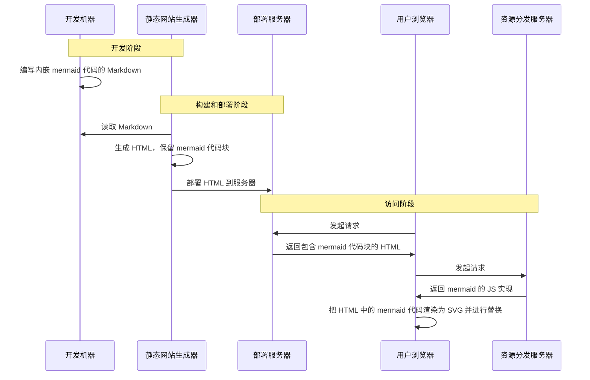

# Mermaid

[官网](https://github.com/mermaid-js/mermaid-cli)

## 简介

Mermaid 是一个用 JavaScript 实现的图表绘制工具，可以通过简单的代码绘制图表。

## 对比

Mermaid 这个工具流行的主要原因就是可以把代码嵌入 MD 文档中。毕竟大多数时候 MD 都会转为 HTML，因此有 JavaScript 实现是个巨大的优势，让 Mermaid 可以直接在客户端完成图片的渲染。比如 Github 的 MD 就支持渲染内嵌的 mermaid 代码，大多数 LLM（比如 DeepSeek）也基本都是用 mermaid 来展示图片的。


```mermaid
sequenceDiagram
    participant DM as 开发机器
    participant SSG as 静态网站生成器
    participant DS as 部署服务器
    participant B as 用户浏览器
    participant RDS as 资源分发服务器
    
    Note over DM, SSG: 开发阶段
    DM ->> DM: 编写内嵌 mermaid 代码的 Markdown
    
    Note over SSG, DS: 构建和部署阶段
    SSG ->> DM: 读取 Markdown
    SSG ->> SSG: 生成 HTML，保留 mermaid 代码块
    SSG ->> DS: 部署 HTML 到服务器
    
    Note over DS, RDS: 访问阶段
    B ->> DS: 发起请求
    DS ->> B: 返回包含 mermaid 代码块的 HTML
    B ->> RDS: 发起请求
    RDS ->> B: 返回 mermaid 的 JS 实现
    B ->> B: 把 HTML 中的 mermaid 代码渲染为 SVG 并进行替换
```

如果你掌握了基本的浏览器调试方法，你会发现你并没有接收到上面这张图片，而是接收到了下面的代码，然后在本地完成了渲染

> [!Tip]- 浏览器调试
> 在 DevTools 的**源代码**栏，你能在 `top/juemuren.github.io/DevNotes/文档工具/Mermaid` 里找到本页面的原始 HTML，你会看到里面只有 `code` 标签而没有 `svg` 标签。你应该还能在 `unpkg.com/mermaid@xx/dist` 里找到 mermaid 的 JavaScript 实现，它把 `code` 标签里的代码渲染为 `svg` 图片并进行了替换
>
> 在 DevTools 的**元素**栏，你会发现上面这张图里已经没有 `code` 标签了，而是被替换为了 `svg` 标签

```mmd
sequenceDiagram
    participant DM as 开发机器
    participant SSG as 静态网站生成器
    participant DS as 部署服务器
    participant B as 用户浏览器
    participant RDS as 资源分发服务器
    
    Note over DM, SSG: 开发阶段
    DM ->> DM: 编写内嵌 mermaid 代码的 Markdown
    
    Note over SSG, DS: 构建和部署阶段
    SSG ->> DM: 读取 Markdown
    SSG ->> SSG: 生成 HTML，保留 mermaid 代码块
    SSG ->> DS: 部署 HTML 到服务器
    
    Note over DS, RDS: 访问阶段
    B ->> DS: 发起请求
    DS ->> B: 返回包含 mermaid 代码块的 HTML
    B ->> RDS: 发起请求
    RDS ->> B: 返回 mermaid 的 JS 实现
    B ->> B: 把 HTML 中的 mermaid 代码渲染为 SVG 并进行替换
```

`mermaid` 还有个 CLI 工具，可以本地完成图片的导出。可以选择 png 或 svg 格式的图片，可以自定义 css 文件，还可以一键把 md 里所有内嵌的 mermaid 导出为图片，并在新输出的 md 文件里引用这些图片。最后一个功能我很喜欢，因为可以配合 pandoc 轻松地让 LLM 生成一个图文并茂的 docx 文档

`plantUML` 是另一种绘制 UML 图表的工具，同样通过代码生成图表。plantUML 图的种类似乎比 mermaid 更丰富一点，但由于是用 Java 实现的，所以体验和生态都没有Mermaid 好。plantUML 一般用来本地生成图片，然后再把图片插入文档，Mermaid 更适合直接提供代码，让接收者自行渲染。

后面只介绍 mermaid-cli 的安装和使用。而对于客户端渲染的需要，大多数 *静态网站生成器* 和 *前端框架* 应该都支持与 mermaid 集成，你可以自行研究。

## 安装

目前 mermaid-cli 的安装非常麻烦，因为没有打包成单个二进制文件，必须安装 NodeJS 运行时并通过 npm 下载。有能力的或者感兴趣的可以看看 [GitHub Issues](https://github.com/mermaid-js/mermaid-cli/issues/467) 来帮忙解决这个问题

整个安装流程大概是这样的

```sh
# 首先设置 PUPPETEER_SKIP_DOWNLOAD，我不设置这个就会报错
$env:PUPPETEER_SKIP_DOWNLOAD=1
# 然后全局安装 mermaid-cli
npm install -g @mermaid-js/mermaid-cli
# 最后再单独安装 chrome-headless，如果已经有的话可以不安装
npx puppeteer browsers install chrome-headless-shell
```

至此就安装完成了，但使用的时候还有些东西需要注意。首先写一个 `"puppeteer.json"` 文件，指定 `chrome-headless` 可执行文件的路径。对于 Windows，可执行文件一般放在 `~/.cache/puppeteer` 目录里，可以自己找找。

```json
{
  "executablePath": "path\\to\\chrome-headless-shell.exe"
}
```

最后使用的时候记得通过 `-p puppeteer.json` 提供这个文件

```sh
mmdc -p puppeteer.json -i example.md -o example.temp.md
```

## 使用

后面的使用示例省略了 `-p` 这个参数

```sh
# 单独导出一个图片
mmdc -i input.mmd -o output.png
# 自定义 css 文件
mmdc --input flowchart.mmd --cssFile flowchart.css -o flowchart.svg
# 转换 md 文件，让接收者直得到图片，不用自行渲染
mmdc -i readme.template.md -o readme.md
```
