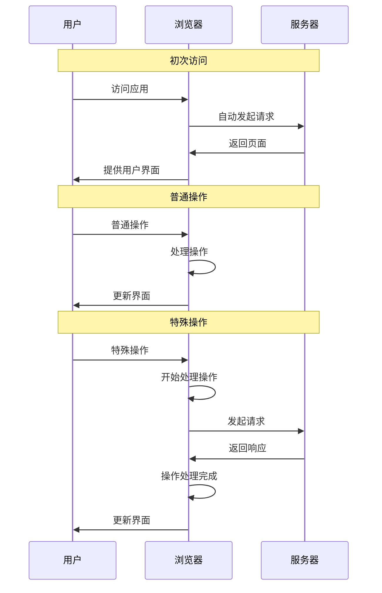
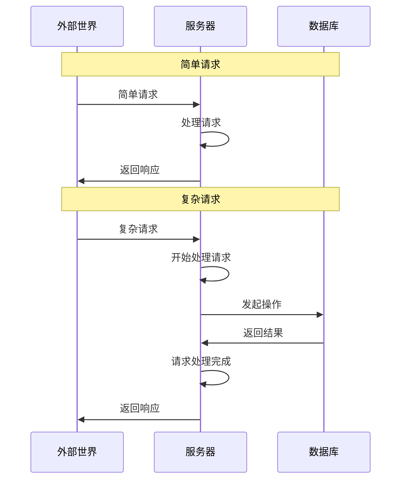

# 网站开发

Web 应用 ~~由于我的强迫症，标题中使用了 *网站* 而非 *Web*，但其实后者才是正确的术语~~ 是指一类能够在浏览器中运行的应用。

> [!Note]- Web 一词的翻译
> Web 一词一直都没有合适的翻译。以下翻译虽然有人使用，但其实都不好。它们都已经有了更准确的英文，乱用会造成混淆
>
> - 网站 Website
> - 网页 Webpage
> - 网络 Network
> - 互联网 Internet
>
> `Web` 在英文里就是个很抽象的词，因此最贴切的中文翻译也一定是抽象的，比如`网`。但显然这个翻译太怪了，所以之后将不翻译 Web 一词

得益于技术的发展，现代 Web 应用已经不再是那种只提供静态资源的普通网站，而几乎可以做到所有原生应用能做到的事情。

现代 *Web* 应用通常都会使用 **前端-后端-数据库** 的三层架构。其中数据库通常不会自己编写，而是使用现成的。因此 *Web* 开发者通常可以分为 *前端开发者* 和 *后端开发者*

## 前端

### 前端基本职责

当用户访问 Web 应用时，浏览器会自动发起一个请求，然后服务器返回一些文件，这些文件构成了用户界面。用户在这个界面中操作，有些操作可以直接在浏览器中完成，有些则需要和服务器通信。前端的职责就是编写用户界面，并处理和服务器的交互。

### 前端主要技术

#### HTML/CSS/JavaScript

前端开发者编写的应用运行在浏览器环境中。代码主体由 **HTML**/**CSS**/**JavaScript** 三部分组成，它们是浏览器的语言，是 Web 的核心。它们各自的分工是非常明确的

- HTML 定义了页面的内容
- CSS 负责页面的样式
- JavaScript 负责页面的逻辑

只用 *HTML* 就可以制作最简单的应用，此时服务器返回的仅仅是静态页面，如果需要新的内容就要发出新的请求。

使用 *CSS* 可以让界面变得精美。CSS 使用声明式的方法定义页面的样式，这使得编写样式非常简单。

使用 *JavaScript* 可以让界面变得动态。JavaScript 可以使用浏览器提供的 DOM API，从而动态地修改页面内容。这也使得单页面应用成为可能，即只向服务器请求初始页面，之后页面更新都通过 JavaScript 完成，这给了用户更流畅的体验。

不过一直以来都有人觉得 **HTML**/**CSS**/**JavaScript** 缺少了某些功能，因此社区不断地在产出解决方案，导致它们都有一些变种。

##### TypeScript

JavaScript 是个缺乏设计的语言，其中 *类型系统* 就是一个很大的问题。虽然它很灵活，但现代的、大型的项目更需要的是安全。

于是后来出现了 TypeScript，它是 JavaScript 的 *超集*。所谓超集就是指它完全兼容 JavaScript，只不过定义了额外的语法，而这些语法就是有关类型的。TypeScript 编译器通过 *类型擦除*，即去掉了 JavaScript 不支持的语法，从而得到了纯正的 JavaScript 代码。

TypeScript 的类型系统使得开发阶段就能够发现大部分错误，而不必等到应用上线后才去处理。因此现在基本上成为了大型应用的标准。

##### Sass/Less

尽管 CSS 已经非常强大了，但仍然缺乏一些编程特性，导致代码重复和冗余，这在大型项目中会变得难以维护。

于是后来出现了一些 CSS 的变种，比如 Sass/Less。它们拓展了 CSS 的能力，并通过预处理器转换成 CSS 文件，这和 TypeScript 的做法非常相似。

Sass/Less 都支持变量、嵌套、混合、继承、运算、函数、条件、循环、导入等很多高级特性，让编写 CSS 舒服了很多。当然，部分特性其实 CSS 也能实现，但具体细节会有差别，且通常用 Sass/Less 会更简单。

##### Markdown

HTML 虽然强大，但语法有点复杂，而且标签套标签的写法是机器友好但反人类的。

于是后来有了 Markdown 这个 HTML 的变种。JavaScript/CSS 的变种都是拓展能力，但 Markdown 却相反，它并不拓展 HTML 的能力，而是简化 HTML 的语法。Markdown 可以通过很多种方法转为 HTML，也能很方便地进行实时渲染。这使得 Markdown 后来不仅仅用于 Web 开发，还在文档领域大放异彩。在今天，Markdown 应该是软件工程里最主流的文档格式。GitHub 的自述文件推荐使用 Markdown，大多数 LLM 也都采用 Markdown 输出内容。

Markdown 有很多不同的标准，比如 CommonMark、GFM 等。由于大多数 Markdown 标准都支持嵌入 HTML 标签，所以某种程度上 Markdown 也确实是 HTML 的超集，毕竟它支持 HTML 不支持的 *简化语法*。

除了 Markdown 外，HTML 还有很多变种，比如 Pug/EJS/Nunjucks/HTMX/JSX/Vue/Svelte 等。它们通常都会实现以下功能中的一个或多个

- 允许在 HTML 文本中插入变量，通过填充值就可以生成 HTML 文件
- 丰富 HTML 原有标签的语义，让其功能更强大
- 支持在 HTML 标签中嵌入 JavaScript 或在 JavaScript 中使用 HTML 标签，让编写代码更方便
- 可以自定义 HTML 标签，从而实现组件化

#### 组件框架/元框架/轻量级框架

**HTML**/**CSS**/**JavaScript** 是逐个成为 Web 标准的。大型项目通常不太希望按照这种方式分离各个部分。因此后来有了组件化的概念，并随着 *组件框架* 的兴起而逐渐成为主流。

组件化是另一种开发思维，它不把应用拆成内容、样式和逻辑三部分，而是把应用拆成一个个组件，每个组件分别处理自己的内容、样式和逻辑。对于大型项目而言，这种拆分方式更易于开发。

为了支持这种组件化的开发方式，大多数 *组件框架* 都定义了自己的语法，它们是无法被浏览器所理解的。因此需要打包器将其转为原生的浏览器语言，即 HTML/CSS/JavaScript。

后来在 *组件框架* 之上又出现了更全面的框架，它们是 *框架的框架*，因此有时被称为 *元框架*。元框架规定了项目的组织结构和一些功能的实现方式，因此通常不如 *组件框架* 本身灵活，但胜在开发效率。

与之相反的，还有一些 *轻量级框架*，它们不如组件框架/元框架强大，但好处是几乎没有学习曲线，并且由于尽量使用原生的 *Web* 功能，应用打包后体积不会很大，胜在小巧和灵活。

随着 Web 生态逐渐发展，前端框架越来越强大，其中一些渐渐不满足于只制作 *Web* 应用了，开始涉足别的领域。

##### Native/Desktop/Hybrid

各个移动端都会提供自己的原生 UI 组件，不同的移动端之间接口通常是不同的。开发者为了应用能够跨平台，得维护逻辑几乎相同的多份代码，这很不方便。于是有了用 *Web 技术* 来开发 *移动应用* 的尝试。最初的实现方式是，构建一个 *桥接层* 来处理 JavaScript 和原生组件的互相调用。

桌面端同样有跨平台的需要。于是有一些框架尝试使用 *Web 技术* 来开发 *桌面应用*。最初的实现方式非常粗暴，就是在应用中自带一个浏览器内核。

随着技术的发展，用 Web 技术开发 *Native/Desktop 应用* 出现了新的方式——在应用中调用系统自带的 *WebView*。这种新的应用形态叫做 *Hybrid 应用*，即混合应用，需要系统本身的支持。

随着这些尝试逐渐成熟，前端也许会走向统一。至于为什么是 *Web* 统一前端，我想这可能是因为它有着无与伦比的生态吧。

#### 更多前端技术

前端变得很快，不仅框架、库、工具等升级得很快，就连底层的 Web 技术也发展得很快。很多内容无法在这里说清 ~~其实是很多技术我也没深入研究过~~ ，你可以自行研究

- WebAssembly
- WebSocket
- WebWorkers
- WebContainers
- WebGL
- WebGPU
- WebRTC
- WebXR
- WebAuthn

### 前端的框架/库/工具

由于大多数前端框架使用 JavaScript/TypeScript 语言进行开发，因此下面的框架/库基本上都和它们有关。另外还有一些 JavaScript/TypeScript 库/工具因为更加通用，并非专属于 Web，所以没有列举在这里，你可以阅读 [JavaScript](../编程语言/JavaScript.md) 章节了解更多。

#### 前端框架

- [React](../库和框架/React.md) 官方说法是 `用于构建 Web 和原生交互界面的库`，不过社区更习惯称其为框架。这应该是目前最流行的前端框架，生态非常好，同时能借助 *React Native* 用 *Web* 技术开发 *Native 应用*，它使用 *桥接* 这种实现方式。
- Next.js 基于 *React* 的全栈框架
- [Expo](../库和框架/Expo.md) 基于 *React Native* 的原生应用框架
- Vue 另一个流行的前端框架
- Svelte 也是一个流行的前端框架
- lit 轻量级的框架，利用原生的 WebComponent 实现组件化

#### 测试框架

- Vitest 前端测试框架
- Jest 也是一个前端的测试框架
- Playwright 端到端的测试框架，会在真实的浏览器环境中测试，并生成详细的报告

#### 样式库

- MUI 遵循 Material 设计范式的 UI 库。提供了 React 形式的组件
- Tailwind CSS 最近非常流行的 CSS 库，和内联样式有点像，但提供了更简单的写法

#### 浏览器插件

大多数前端框架都会提供相关的浏览器插件来辅助调试，这些插件就不在此处列出了，应该可以在框架的官网找到介绍

- Wappalyzer 用来查询 Web 应用技术栈的插件 ~~我非常喜欢用这个插件查看我常用网站的技术栈~~

#### 打包器

- Vite 是打包器，同时也是开发服务器。非常好用，配置简单、速度快、有热模块替换，用过就忘不了
- Webpack 既是打包器也是开发服务器

#### 开发服务器

由于应用运行在浏览器中，所以前端开发时经常需要启动一个本地开发服务器，从而可以在浏览器中访问应用。大多数打包器都附带了这个功能，但你也可以选择别的工具

- http-server 用 JavaScript 写的 http 服务器。Python 也内置了一个 http 服务器，可以通过 `python -m http.server` 启动，但功能比较简陋
- devd 开发服务器，支持文件监视和自动重载，由 Go 编写，同样没有外部依赖。我写简单项目时喜欢用这个工具
- miniserve 静态文件服务器，由 Rust 编写，因此没有外部运行时依赖

#### 模拟接口

前端开发时可能会遇到后端尚未搭建好，但又希望通过请求来获取数据的情况。这时可以使用一些辅助工具

- MSW 通过拦截请求来模拟接口，因此接口实际上是浏览器环境中直接实现的。
- json-server 可以处理 RESTful 请求并返回 json 的服务器，配置起来很简单。
- faker 为测试和开发生成假数据，这样就不用自己编数据了。一般和 json-server 一起使用。
- Mirage 一个运行在浏览器里的服务器，相比 json-server 更灵活，但搭建起来也更繁琐 ~~我觉得用这个和实际写了个后端已经没什么区别了~~ 。

## 后端

### 后端基本职责

收到外部世界的请求后，服务器要对请求进行处理。部分请求可能需要用到数据。直接以文件形式在服务器上存储数据是很不靠谱的，因此通常会使用数据库来存储数据。后端的职责就是实现需要的接口，并处理和数据库之间的交互。

### 后端主要技术

#### OS

后端开发者编写的应用运行在服务器环境中。由于大多数服务器都使用 Linux 系统，因此对于 Linux 应该要有一点基本的了解。

#### API

外部世界向服务器发送请求，然后收到响应，如果对这个过程进行一下抽象，那么可以看作服务器实现了一个 API，即应用程序编程接口。这个接口可以在前端调用，从而丰富应用的功能。

API 设计方式有很多，在实践中通常会使用 `RESTful` 或 `GraphQL` 的范式。实现这些范式可以使用框架。基本上主流的编程语言都有实现 `RESTful` 的框架，而 `GraphQL` 比较新，目前好用的框架比较少。

#### SQL

前端开发绕不开 **HTML**/**CSS**/**JavaScript**，而后端开发在这方面相对自由一点，通用编程语言都可以写那些能够在服务器里运行的程序。不过由于要处理和数据库的交互，因此大多数时候数据库语言，即 **SQL** 也是绕不开的。

当然了，正如同前端可以通过框架尽量不直接写 **HTML**/**CSS**/**JavaScript**，后端也可以利用 *ORM/ODM* 来尽量少写 **SQL**

### 后端的框架/库/工具

由于后端可选的语言很多，所以下面的框架/库并不局限于一种语言。有些框架/库可能提供了多个语言的接口，有些可能只有特定语言才可以使用。对于那些编程语言各自的通用库/工具，它们并不专属于 Web，因此不会列举在这里，可以在[编程语言](../编程语言/index.md)章节中查看对应的语言。

#### 后端框架

- Express 用来实现 RESTful 接口的 JavaScript 框架
- FastAPI 用来实现 RESTful 接口的 Python 框架
- Apollo 用来实现 GraphQL 接口的 JavaScript 框架，分为 Server 和 Client，后者用来在前端调用 GraphQL 接口

#### 数据库映射

- mongoose JavaScript 的 ODM 库，支持 MongoDB 数据库
- sequelize JavaScript 的 ORM 库。支持很多关系数据库，包括 PostgresSQL、SQLite、MySQL 等

#### 日志

- morgan JavaScript 的请求日志库，配置起来很简单

#### 安全

- bcrypt 加密库，很多语言都有这个库
- jsonwebtoken 处理令牌验证的库，有非常多的语言都实现了这个库的功能
- cors 处理 CORS 错误的库，很多语言都有这个库

#### 测试接口

- Rest Client VSCode 插件，通过 .rest 和 .http 文件测试接口
- httpYac 提供了 CLI 和 VSCode 插件多种形式，同时兼容并拓展了 Rest Client 使用的语法
