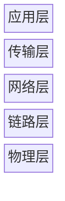
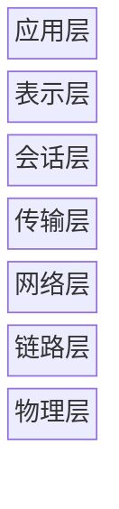

# 网络工具

## 基本概念

网络（本文指计算机网络）是这个信息时代的根基。对于开发者而言，有必要了解一些网络的基础知识并学会使用各种网络工具。

部分内容放到了专门的主题中

- [Web 安全](../安全工具/index.md)
- [Web 开发](../应用开发/Web.md)
- [API 开发](../应用开发/API.md)

## 主要技术

### 网络协议栈

网络协议形成了一个个抽象层级，上层协议直接基于下层协议进行定义。最常见的模型是 **5** 层 Internet 协议栈



  1. 应用层面向用户和应用程序，需根据具体的应用场景来设计。应用层传输的数据称为应用层报文。代表协议有
    - HTTP/HTTPS 超文本传输协议。用于 Web 文档的传输
    - FTP 文件传输协议。用于文件的传输
    - SMTP 简单邮件传输协议。用于电子邮件的传输
    - DNS 域名系统。用于解析域名
  2. 传输层在应用程序端点之间传送应用层报文。传输层传输的数据称为报文段。代表协议有
    - TCP 传输控制协议。面向连接，可靠，有确认重传机制
    - UDP 用户数据报协议。无连接，高效，但不保证可靠
  3. 网络层负责将报文段从一台主机传输到另一台主机，通常要处理逻辑寻址和路由选择。网络层传输的数据称为数据报。代表协议有
    - IP 互联网协议。用于定义 IP 地址
    - BGP 边界网关协议。用于根据 IP 地址进行路由
    - ARP 地址解析协议。用于将 IP 地址转换为 MAC 地址
    - ICMP 互联网控制消息协议。用于网络诊断和发送错误报告
  4. 链路层负责将数据报从一个节点传输到下一个节点。链路层传输的数据称为帧。代表协议有
    - Ethernet 以太网。最流行的有线局域网技术
    - WiFi 无线保真。最流行的无线局域网技术
    - PPP 点对点协议。用于直接连接两个节点
  5. 物理层负责将帧中的每个比特从一个节点传输到下一个节点，通常是以电磁波的形式

另外还有 **7** 层 OSI 模型，大致和 Internet 协议栈一样，只是多了两层协议



- 表示层的作用是使通信的应用程序能够解释交换数据的含义
- 会话层提供了数据交换的定界和同步功能

### 局域网

基于 IP 地址可以将网络分为公网和内网，后者也被称为局域网。处于以下范围的 IP 为内网 IP

- `10.0.0.0 - 10.255.255.255`
- `172.16.0.0 - 172.31.255.255`
- `192.168.0.0 - 192.168.255.255`

公网 IP 和内网 IP 有以下主要区别

| 特性         | 公网                                | 内网                                        |
| :----------- | :---------------------------------- | :------------------------------------------ |
| **唯一性**   | IP 是全球唯一的                     | IP 不是全球唯一的，但在当前局域网中不能重复 |
| **可访问性** | 理论上所有设备都可以直接访问公网 IP | 外部网络无法直接访问局域网中的 IP           |

在同一个局域网内，设备之间可以互相访问。当然跨局域网的访问也是支持的

- 内网设备要访问公网，需要使用 **NAT**，即网络地址转换。这个转换通常由具有公网 IP 的设备（比如路由器）完成，它将数据的源 IP 替换为自己的 IP 然后进行转发
- 公网设备要访问内网，通常需要进行内网穿透。内网穿透通常都会用到反向代理技术，即通过一个有公网 IP 的中间服务器将外部请求转发到内部端口

公网/内网这种设计极大地节省了公网 IP 地址，同时也隐藏了内网结构，保护了内网安全。因此不要再担心泄露内网 IP 会不会出问题了。

### 网络代理

网络代理可分为 **正向代理** 和 **反向代理**

#### 正向代理

正向代理是 **客户端代理**，即在客户端通过代理服务器转发请求

正向代理通常是为了以下目的

- 隐藏客户端。服务端只知道代理服务器的 IP，不知道用户的真实 IP
- 内网管理。代理服务器可以过滤或限制客户端的请求
- 缓存加速。代理服务器可以缓存常用资源，减少带宽消耗
- 突破访问限制。客户端可以通过代理访问被限制的资源，当然前提是代理服务器可以被客户端访问

#### 反向代理

反向代理是 **服务端代理**，即在服务端通过代理服务器转发请求

反向代理通常是为了以下目的

- 隐藏服务端。客户端不知道后端服务器的真实 IP 和具体架构
- 安全防护。代理服务器可以作为屏障，过滤一些恶意请求
- 负载均衡。代理服务器可以将请求分发到多台服务器，从而提高系统整体的性能
- 缓存加速。代理服务器可以缓存常用资源，从而加速内容的分发。CDN（内容分发网络）就是反向代理技术的一种应用

### 网络虚拟化

网络虚拟化是指通过软件技术将物理网络资源进行抽象，从而可以在同一套硬件上模拟出多个相互隔离的、可灵活配置的虚拟网络

网络虚拟化有两种不同的理念

- SDN 软件定义网络。将控制平面和数据平面分离，由一个中央控制器通过标准协议统一管理底层网络设备，从而实现网络的可编程化和自动化
- NFV 网络功能虚拟化。将传统专用硬件的网络功能，通过软件进行模拟，从而提升部署的灵活性和资源的利用率

基于 NFV 理念，有几种常见的虚拟网络设备

  - TUN/TAP 通常是由操作系统内核提供的
    - TUN 模拟网络层设备，处理网络层数据，支持所有基于 IP 的协议
    - TAP 模拟链路层设备，处理链路层数据，支持所有基于 Ethernet 的协议
  - vNIC，即 **虚拟网卡**。功能类似物理网卡，有独立的 MAC 地址和 IP 地址
  - vSwitch，即 **虚拟交换机**。可模拟物理交换机的功能

网络虚拟化有多种应用场景，比如 **虚拟机网络** 和 **虚拟专用网**

#### 虚拟机网络

虚拟机使用 **虚拟网卡** 和 **虚拟交换机** 与宿主机、外部网络进行通信

虚拟机的网络模式通常有以下几种

- **Bridged** 桥接模式。虚拟机通过虚拟交换机直接连接到物理网络，拥有独立的局域网 IP
- **NAT** 网络地址转换模式。虚拟机通过宿主机进行网络地址转换来访问外部网络，这种方式可对外隐藏内部的网络结构
- **Host-Only** 仅主机模式。虚拟机只能和宿主机通信，无法连接到外部网络
- **Mirrored** 镜像模式。虚拟机共享宿主机的 IP 地址，并通过端口转发规则来访问外网。这使得配置代理更加简单，但可能发生端口冲突

> [!Note]- WSL VirtioProxy
> WSL 有一种叫做 **VirtioProxy** 的网络模式，但我目前并没有找到任何相关资料。微软官方文档里提到这个概念的只有 [一篇](https://learn.microsoft.com/en-us/windows/wsl/wsl-config)，但那篇文档也没有对这个概念进行介绍

#### 虚拟专用网

VPN，即虚拟专用网，是指在公共网络上建立一条安全的私有通信隧道

VPN 通常会包含以下技术

- Tunneling 隧道。确保将原始数据封装后再传输
- Encryption 加密。确保即使数据在传输过程中被拦截，内容也无法被读取
- Authentication 认证。确保只有授权的用户才能接入隧道

由于 VPN 要实现带认证的双向加密隧道，因此 VPN 软件通常都是 **C-S** 架构的，既有客户端也有服务端

> [!Note]- VPN 和正向代理的区别
> VPN 和正向代理很相似，但二者实际区别很大
>
> 在典型的 VPN 应用场景中，VPN 只用来 **建立安全的网络通道**，比如访问公司/学校内网
>
> ```mermaid
> graph LR
> 用户 --VPN--> 公司/学校内网
> ```
>
> 在典型的正向代理应用场景中，正向代理只用来 **转发客户端请求**，比如借助代理服务器访问被限制的资源
>
> ```mermaid
> graph LR
> 用户 --正向代理--> 被限制的资源
> ```
>
> 由于常见的科学上网工具同时提供了 VPN 和正向代理的功能，因此造成了混淆。这些工具既需要 VPN 来建立安全的网络通道，又需要正向代理来转发请求
>
> 以 Clash 为例，该工具提供了 **系统代理** 和 **虚拟网卡** 两种模式。它们都实现了 VPN + 正向代理的功能，但具体细节有一些差异
>
> - 系统代理在应用层工作，通常只转发特定应用的 HTTP/HTTPS/SOCKS 流量
> - 虚拟网卡在网络层工作，可以接管设备所有基于 IP 的流量

### 网络去中心化

#### 点对点下载

HTTP/FTP 等应用层协议是高度中心化的，这会带来一些缺陷

- 下载速度受服务器带宽影响，访问量大时吞吐量会出现明显的下降
- 下载渠道为单一的服务器，一旦服务停止就无法继续获取资源

点对点（P2P）下载协议是去中心化的，下载源不是单一的服务器，每个拥有资源的人都可以成为上传者。P2P 下载协议会匹配上传者和下载者，并建立网络连接。通过这种方式，P2P 下载解决了原先的部分问题

- 下载速度仍然受到上传者上传带宽的限制，但可以通过和多个上传者进行连接，从而填满自己的下载带宽
- 下载渠道不局限于单个服务器，只要世界上有人拥有资源并持续分享，那么该资源就可以传遍互联网的每个角落

P2P 下载中有几个比较著名的协议

- BitTorrent，种子。该协议依赖 `.torrent` 种子文件，它是资源的元数据，包含了 Tracker 服务器地址、文件列表、哈希校验码等。下载客户端首先需要有种子文件，然后从 Tracker 服务器中获取该资源的上传者名单，接着再和这些上传者建立连接。
- Magnet，磁链。该协议依赖 `magnet:?xt=urn:btih:xxxx` 磁力链接，它包含了统一的前缀和唯一的标识符。下载客户端首先需要有磁力链接，然后向 DHT 网络询问标识符对应的种子文件地址，获取种子文件后就和 BT 协议一样了。

由于 P2P 协议较为复杂，因此它们通常不被包含在浏览器中，需要使用专门的客户端。而这种客户端又存在不同的类型

- 本地客户端。下载发生在本地机器，会受到本地网络环境的限制，比如带宽大小/连接数/运营商政策等。由于依赖上传者，因此冷门资源和热门资源的下载速度差异巨大
- 云客户端。下载发生在云服务器，资源最终会保存到你的云盘中。由于服务器通常缓存了大量资源，因此整个下载过程非常快，即使资源很冷门。但这种云服务通常都要付费

#### 区块链

区块链是一种去中心化技术，其目的是在互不信任的网络环境中，让所有人对同一个记录达成共识，且该记录没有人可以私自篡改。

区块链技术常用于发行虚拟货币。传统上，资产的记录和转移依赖中央机构，这种模式存在一些固有缺陷

- 单点故障。中心机构一旦被攻击或出现故障，整个系统都会瘫痪
- 信任成本。中心机构不一定诚实，可能会篡改记录、挪用资金等
- 透明度低。中心机构的账本通常不对外公开，其公正性难以验证

区块链尝试在没有中央机构的情况下，创造一个可信的公共账本。其核心是一些数据结构和算法

- 数据结构为区块链。区块链是 *由区块形成的链*，交易会一批一批地被打包成区块，每个新区块都包含上一个区块的哈希值，形成一条链。这种设计使得任何对旧区块的篡改，都会导致该区块及其后所有区块的哈希值失效，从而能被迅速检测
- 算法是共识机制。共识机制决定了 *由谁来打包新区块* 以及 *如何让所有节点同意新区块是有效的*，前者通常要进行大量的计算来竞争记账权（比如工作量证明），后者通常要使篡改的成本高到不现实（比如最长链规则）。其设计常常引入经济激励和计算成本，使得诚实记账有利可图，而作恶则极不划算

> [!Note]+ 比特币的交易过程和防篡改设计
> 以比特币为例，具体的交易过程大致如下
>
> 1. 广播。当用户想发起转账时，会创建一条交易信息，并广播到网络中
> 2. 验证。其余节点会收集未确认的交易，验证其有效性，然后尝试将一批有效的交易打包成一个区块
> 3. 竞争。打包者需要为区块寻找一个随机数，使哈希值满足特定的条件，找到合格随机数的节点会将自己打包的区块广播到网络中
> 4. 同步。其它节点再次验证该区块及其中交易的有效性，并检查哈希值是否符合要求。验证通过后，新区块将加入节点本地保存的区块链末尾
> 5. 激励。区块被接受后，打包者会获得两笔钱，分别是逐年指数递减的固定奖励和该区块内所有交易的手续费
>
> 假设攻击者想要撤销一条包含在区块 `#N` 中的交易记录，那么攻击者需要
>
> 1. 在 `#N` 区块中删除掉想撤销的那笔交易记录
> 2. 由于 `#N` 区块被修改，该区块及其后所有区块的哈希值都已失效，攻击者需要重新寻找随机数，秘密地挖掘一条新链
> 3. 让秘密链的长度超过主链，因为节点遵循最长链规则，只有秘密链比主链更长时，广播出去的篡改记录才会被接受
> 4. 主链和秘密链同时增长，攻击者必须拥有更高的算力，才能让秘密链的平均增长速度高于主链，从而最终强制全网重组
>
> 也就是说，攻击者的算力必须高于所有诚实节点的算力才有可能成功，而在共识机制激励诚实记账的情况下，这几乎不可能发生。即使发生了，这种攻击也必然导致该虚拟币的价值暴跌，最终使攻击者自身持有的货币贬值。因此篡改记录显然是不理性的行为，拿这些算力去巩固主链反而更划算。
>
> 虚拟币的安全就这样得到了 **计算机技术** 和 **博弈论** 的双重保障。

通过以上设计，区块链解决了传统模式的部分问题

- 去中心化。任何单一节点的故障或攻击都不会影响整个网络的运行，因为账本数据由全球成千上万个节点共同维护和存储
- 不可篡改。每个区块都通过哈希值与前一个块链接，修改一个块需要同时修改它之后的所有块，并让秘密链的增长速度超过主链，这在实践中几乎不可能
- 透明可追溯。所有交易记录都是公开的，任何人都可以追溯一个资产从诞生到当前的所有流转记录
- 分布式共识。区块链用精密设计的算法取代了对中心机构的信任，从而让所有分散的节点达成一致

区块链技术有几个比较著名的代表

- 比特币，第一代区块链技术的代表。比特币实现了一种去中心化的虚拟货币，成为了区块链技术的代名词
- 以太坊，第二代区块链技术的代表。以太坊引入了智能合约的概念，让区块链从分布式账本变为了去中心化应用平台

区块链显然也是需要客户端的，这些客户端存在不同的类型

- 全节点。下载并验证从创世区块到现在的全部历史交易数据，独立执行所有规则，完全参与网络共识
- 轻节点。只下载区块头，依赖全节点获取交易详情，效率更高但不独立
- 托管服务。用户将资产交由第三方平台管理。这种客户端更加便捷，但与区块链本来的理念相悖

## 工具

### 浏览器

- lynx 纯文本网页浏览器，可以在命令行中使用
- [Chrome](Chrome.md) 最流行的浏览器，提供了 headless 模式以便在命令行中使用

### 下载器

- wget 非交互式的网络文件下载工具
- aria2 支持多协议、多连接的下载工具
- Motrix 一个基于 `aria2` 的、带 GUI 的下载客户端
- Pikpak 一个 P2P 下载的云客户端
- yt-dlp 可从多个视频网站下载视频的工具
- gallery-dl 可从多个图片网站下载图片的工具

### 服务器

反向代理服务器

- Nginx 反向代理服务器，非常流行，高性能且特性丰富
- Caddy 反向代理服务器，可自动配置 HTTPS 和反向代理，但生态较新

正向代理服务器

- Squid 正向代理服务器，常用于缓存加速和访问控制
- Xray/V2Ray 正向代理服务器，常用于突破访问限制

### 内网穿透

如前所述，内网穿透需要一个有公网 IP 的中间服务器。这个服务器可以由服务商提供，也可以自己搭建

- ngrok 内网穿透工具，使用官方提供的服务器，需要付费订阅
- frp 内网穿透工具，开源免费，但需要自己部署服务器，类似的还有 `rathole`

### HTTP 客户端

- curl 命令行 URL 处理器
- httpx 一个用 Python 写的 HTTP 客户端

### DNS 客户端

- nslookup 经典的域名查询工具
- doggo 易用的命令行 DNS 客户端

### 网络分析

- netcat 用于读取和写入网络连接数据的工具
- traceroute 路由追踪工具
- ping 用于发送 ICMP 数据包的工具
